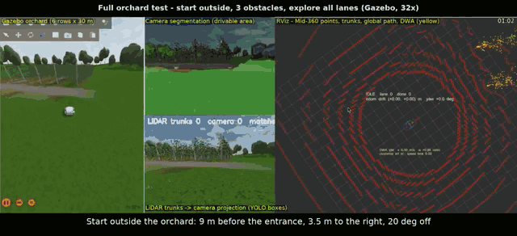
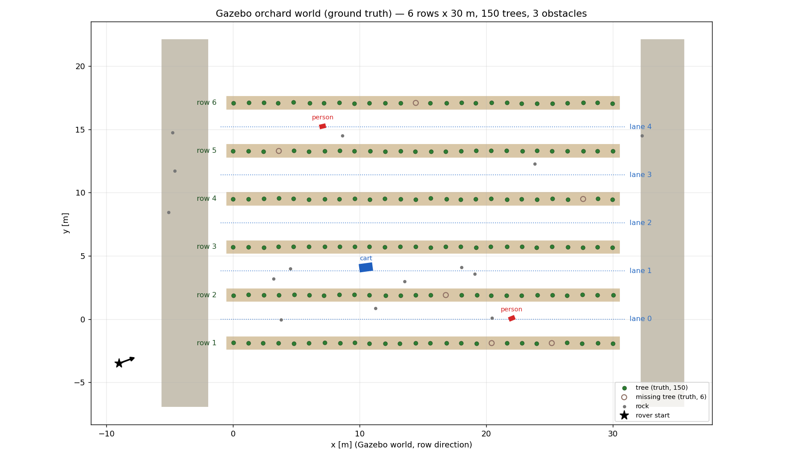
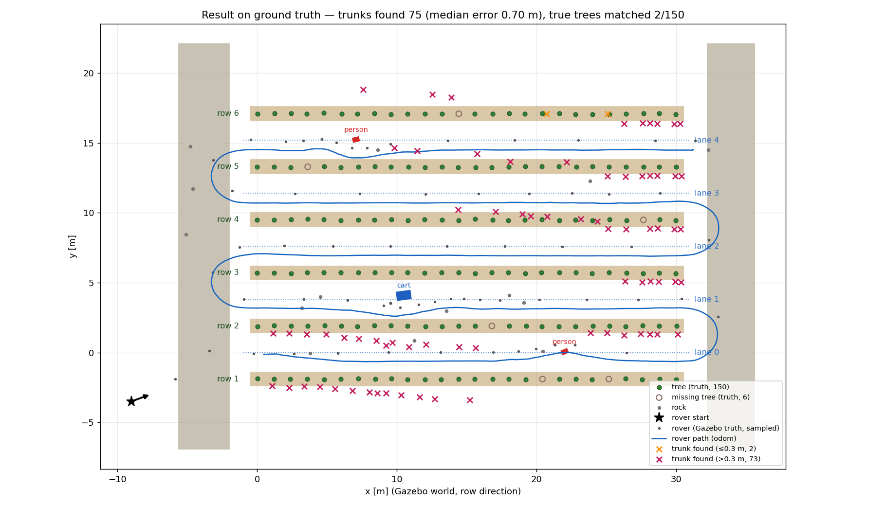
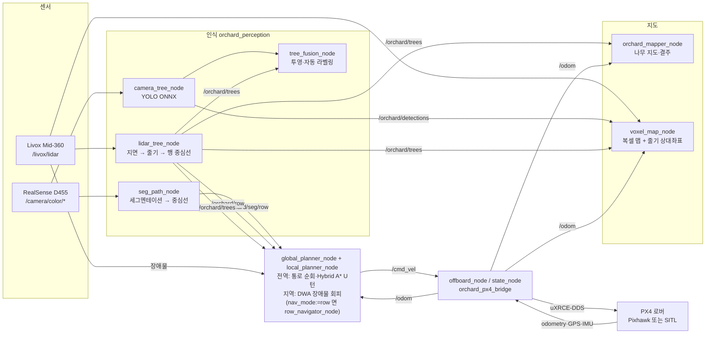

# orchard-rover — 과수원 자율주행 로버 (UNIST BTS 유니주행차)

과수원 행간을 스스로 따라 달리고, 과수(줄기)를 인식해 **지도**로 남기는 로버의 소프트웨어입니다.
PC·맥에서는 Gazebo 시뮬레이션으로, Jetson Orin 에서는 실차로 **같은 코드**가 돌아갑니다.

> 처음 왔다면: **[학생 매뉴얼 `docs/MANUAL.md`](docs/MANUAL.md)** 를 먼저 읽으세요 (설치 → 첫 실행 → 코드 구조 → 기능별 설명 → 수정·시험 방법).

| 항목 | 구성 |
|---|---|
| OS / 미들웨어 | Docker, Ubuntu 24.04, ROS 2 Jazzy |
| 오토파일럿 | PX4 v1.17.0 (Ackermann 로버), Micro XRCE-DDS Agent v2.4.3 로 ROS 2 와 연결 |
| 센서 | Livox Mid-360 (3D LiDAR), Intel RealSense D455, PX4 GPS·IMU |
| 탑재 컴퓨터 | NVIDIA Jetson Orin (JetPack 7.2, Ubuntu 24.04) |
| 시뮬레이터 | Gazebo Harmonic (울산 애플팜 조건: 행간 3.8 m, 주간 1.2 m, 잔디 5~15 cm) |

## 시연 — 전체 과수원 자율주행 (Gazebo, 2026-09-26)

[](docs/media/full_orchard_32x.mp4)

과수원 밖(입구 9 m 앞, 오른쪽 3.5 m, 20° 비스듬히)에서 출발 → LiDAR 로 끝 통로 입구를 찾아 들어감 → 6열 × 30 m 과수원의 통로 5개를 U턴 4번으로 모두 돌고, 끝 열을 확인한 뒤 정지.
통로 안의 사람 2명과 운반차 1대는 비켜 지나갑니다. 화면은 왼쪽부터 Gazebo | 카메라 세그멘테이션(위)·LiDAR 줄기 → 카메라 투영과 YOLO 박스(아래) | RViz(점군·줄기·전역 경로·DWA 후보).

- 영상: [32배속 전체 (82초, 7.7 MB)](docs/media/full_orchard_32x.mp4). 위 그림은 처음 24초 미리보기입니다.
- 배속 없는 고화질 원본(1배속 44분, 약 640 MB)은 용량 때문에 [Releases](https://github.com/pathcmd95/orchard-rover/releases) 에 따로 올려 두었습니다.
- 맥 Docker 의 Gazebo 는 실시간의 약 10 % 로 돌아서, 1배속 녹화에서도 로버가 실제보다 약 10배 느리게 보입니다.

| Gazebo 월드 정답 지도 | 정답 위 결과 (궤적 · 찾은 줄기) |
|---|---|
|  |  |

결과: 통로 중심 횡오차 RMS 3.4 cm / 최대 8.4 cm (Gazebo 참 위치, 장애물 ±4 m 밖). 줄기 지도는 이 시험에서 통째로 0.5~0.8 m 밀렸습니다 (알려진 한계, 8절).
그림은 `tools/mapping/world_map.py` 로 만듭니다.

## 1. 무엇을 하나

| 기능 | 한 줄 설명 | 코드 |
|---|---|---|
| LiDAR 과수 인식 | 점군 → 지면(RANSAC) → 지면 위 0.25~0.7 m 세로 기둥 = 줄기 → 좌/우 열 직선 → 통로 중심선 | `orchard_perception/lidar_tree_node.py` |
| 카메라 YOLO 줄기 검출 | ONNX 모델로 영상 속 줄기 박스. **학습 라벨은 LiDAR 가 자동 생성** | `camera_tree_node.py`, `tree_fusion_node.py` |
| 주행가능 영역 세그멘테이션 | 7개 클래스 → 주행가능 픽셀을 지면에 역투영 → 카메라 중심선 → LiDAR 와 융합 | `seg_path_node.py` |
| **전역 경로계획** | 달리며 본 줄기로 열·통로 모델 → 모든 통로를 도는 경로, 행 끝 U턴은 **Hybrid A***, U턴 뒤 odom 흐름 보정 | `orchard_planning/global_planner.py` ([docs/09](docs/09_path_planning.md)) |
| **과수원 진입** | 과수원 밖에서 LiDAR 줄기로 열·통로를 찾아 **끝 통로 입구** 결정 → Hybrid A* 로 입구 앞 정렬점까지 (`approach:=true`) | `orchard_planning/approach.py` |
| **지역 경로계획** | **DWA** 로 전역 경로 추종 + LiDAR 장애물 **회피** (차체 원 3개 충돌 검사), 막히면 짧은 후보·빠져나오기 → `/cmd_vel` | `orchard_planning/dwa.py` |
| 행간 자율주행 (예전 `nav_mode:=row`) | 통로 중심선을 Pure Pursuit 로 추종, 통로 장애물 감속·정지 | `orchard_navigation/controller.py` |
| 행 끝 U턴 (예전 `nav_mode:=row`) | 본 줄기로 **다음 통로 위치 추정 → Dubins 경로** → LiDAR 로 넘겨받아 진입 | `orchard_navigation/headland.py`, `mission.py` |
| 탐사 | 통로 수를 몰라도 끝 열을 판단해 모든 통로 순회 (`explore:=true`) | `mission.py` |
| 나무 지도 | 열·나무 번호·결주 후보·지주 분리, CSV/JSON(위경도) | `orchard_navigation/orchard_mapper_node.py`, `treemap.py` |
| **복셀 맵 + 줄기 지도** | LiDAR 복셀 맵 위에 YOLO 줄기 위치를 매핑, **출발점 (0,0,0) 기준 상대좌표**로 저장, 열별 줄기 표(엑셀·한글용) | `orchard_mapping/` ([docs/07](docs/07_voxel_map.md)) |
| 정답 지도 그림 | 시뮬 월드 정답(나무·결주·장애물·출발 자세) + 주행 궤적·찾은 줄기 겹침 PNG | `tools/mapping/world_map.py` |
| PX4 연동 | cmd_vel → PX4 v1.17 로버 Offboard 속도 벡터, PX4 → /odom·/gps/fix·/imu | `orchard_px4_bridge/` |

## 2. 시스템 구성



## 3. 빠른 시작

컴퓨터에 맞는 쪽 하나만 따라 하면 됩니다. 두 방법 모두 **완성 이미지**(PX4·Gazebo·ROS 2 + 이 저장소 코드·모델, 약 10 GB)를 받아 씁니다. 받는 컴퓨터에 맞는 것(일반 PC amd64 / Apple Silicon 맥 arm64)이 자동으로 골라집니다.

### 맥 (Apple Silicon) — 녹화 영상으로 보기

맥의 Docker 는 GPU·화면을 못 써서 Gazebo 창이 뜨지 않습니다. 컨테이너 안 가상 화면에서 돌리고 **녹화 영상**으로 확인합니다 (실시간의 5~10 % 속도).

1. [Docker Desktop](https://www.docker.com/products/docker-desktop/) 설치 → 실행 → Settings → Resources 에서 메모리 12 GB 이상, 디스크 80 GB 이상
2. 터미널에서 저장소와 이미지 받기 (이미지는 한 번만)
   ```bash
   git clone https://github.com/pathcmd95/orchard-rover.git && cd orchard-rover
   ./scripts/docker_share.sh pull
   ```
3. 짧은 시험 설정 (안 하면 6열 × 30 m 전체 과수원을 돌아 1시간 가까이 걸림)
   ```bash
   printf 'LAUNCH_ARGS="scenario:=follow camera_lite:=true"\n' > scripts/demo.env
   ```
4. 실행 (또는 Finder 에서 `run_gazebo_demo.command` 더블클릭)
   ```bash
   ./scripts/gazebo_demo_job.sh
   ```
5. 10~15분 뒤 `data/media/gazebo_<날짜시각>/` 에 `gazebo.mp4`, `rviz.mp4`, 횡오차 `lane_error.txt` 가 생깁니다.

자세히는 [MANUAL 3-2절](docs/MANUAL.md).

### 리눅스 PC (Ubuntu, NVIDIA GPU 권장) — 화면으로 보기

1. Docker Engine 설치 (+ NVIDIA GPU 면 NVIDIA Container Toolkit) — [docs/01 2절](docs/01_install.md)
2. 저장소와 이미지 받기
   ```bash
   git clone https://github.com/pathcmd95/orchard-rover.git && cd orchard-rover
   ./scripts/docker_share.sh pull
   ```
3. 컨테이너에 들어가 실행 — 1~2분 뒤 Gazebo·RViz 창이 뜨고 로버가 스스로 출발합니다
   ```bash
   ./scripts/docker_run.sh sim
   # 컨테이너 안
   ./scripts/build_ws.sh && source ros2_ws/install/setup.bash
   ros2 launch orchard_bringup sim.launch.py scenario:=follow
   ```

자세히는 [MANUAL 3-1절](docs/MANUAL.md). **윈도우**는 Docker Desktop + WSL2(Ubuntu 24.04) 를 설치한 뒤 WSL 터미널에서 리눅스 순서대로 합니다 ([docs/01 2-1절](docs/01_install.md)).

### 참고: 이미지를 직접 빌드하려면

`docker/` 아래 설치 스크립트를 고쳤을 때만 필요합니다 (30~90분): `./scripts/docker_build.sh sim`. 직접 빌드한 `orchard-rover:sim` 이 있으면 스크립트가 그것을 먼저 씁니다.

### 구간 시험 (짧게, 약 5분)

리눅스는 `ros2 launch orchard_bringup sim.launch.py scenario:=<이름>`, 맥은 `scripts/demo.env` 의 `LAUNCH_ARGS="scenario:=<이름> camera_lite:=true"` 로 고른 뒤 `./scripts/gazebo_demo_job.sh`.

| `scenario:=` | 월드 | 확인하는 것 |
|---|---|---|
| `follow` | 2열 × 15 m, 1통로 | 행 추종 횡오차 |
| `uturn` | 3열 × 12 m, 2통로 | 행 끝 → U턴 계획 → 다음 통로 진입 |
| `edge` | 3열 × 12 m, 탐사 | 끝 열 판정 → DONE, 나무 지도 저장 |
| `obstacle` | 2열 × 15 m, 장애물 1 | 통로 장애물: planner 는 비켜 지나감 / row 는 감속·정지 |
| `approach` | 3열 × 12 m, 과수원 밖 출발 | 입구 찾기 → 정렬점 → 통로 0 진입 |

전체 과수원(위 시연, 맥에서 약 45분): `scenario` 없이 `explore:=true obstacles:=3 approach:=true spawn_x:=-9.0 spawn_y:=-3.5 spawn_yaw:=0.35 camera_lite:=true`.

## 4. 코드 지도 — "무엇을 고치려면 어디로"

```
orchard-rover/
├─ README.md               ← 지금 이 파일
├─ docs/                   학생 매뉴얼(MANUAL.md/.docx)과 주제별 문서 01~09, 참고문헌(REFERENCES.md), media/(시연 영상·그림)
├─ ros2_ws/src/            ROS 2 패키지 (각 폴더에 README.md)
│  ├─ orchard_perception     인식: LiDAR 줄기·행, YOLO, 융합·자동 라벨링, 세그멘테이션
│  ├─ orchard_navigation     주행: Pure Pursuit, 미션 상태기계, U턴 계획, 나무 지도
│  ├─ orchard_mapping        복셀 맵 + YOLO 줄기 위치 → 출발점 기준 상대좌표
│  ├─ orchard_planning       전역 경로계획(통로 순회·Hybrid A*) + 지역 경로계획(DWA)
│  ├─ orchard_px4_bridge     ROS 2 ↔ PX4 (Offboard 명령, odom/GPS/IMU)
│  ├─ orchard_gazebo         과수원 월드·로버 모델 생성, 시뮬 평가(횡오차)
│  ├─ orchard_description    URDF, config/rover.yaml (센서 장착 위치의 단일 출처)
│  ├─ orchard_msgs           Tree, TreeArray, RowCenterline 메시지
│  └─ orchard_bringup        launch (sim/robot/autonomy), 파라미터(sim.yaml/robot.yaml), RViz
├─ tools/                  ROS 밖 도구: training/(YOLO·세그 학습), sim_checks/, mapping/(복셀 맵·줄기 표·정답 지도 그림)
├─ scripts/                docker_build/run/share, build_ws, test_ws, gazebo_demo_job (README.md)
├─ docker/                 Dockerfile(base/sim/robot), Dockerfile.full(배포용), 설치 스크립트
├─ px4/airframes/          PX4 SITL 에어프레임 51010_gz_orchard_rover
├─ models/                 학습한 ONNX (git 제외, 드라이브·이미지로 공유)
└─ data/                   실행 결과: media/ 영상, maps/ 나무 지도, voxel_maps/ 복셀 맵, 데이터셋 (git 제외)
```

| 이런 걸 바꾸고 싶다면 | 여기 |
|---|---|
| 속도, 장애물 여유, 경로 추종 (planner) | `sim.yaml` → `local_planner_node.dwa.*` / `orchard_planning/dwa.py` |
| 통로 수, U턴 반경·여유, odom 보정 (planner) | `sim.yaml` → `global_planner_node.plan.*` / `orchard_planning/global_planner.py` |
| 속도, 전방 주시거리 (예전 row) | `sim.yaml` → `row_navigator_node.follow.*` / `controller.py` |
| U턴 방식·반경 (예전 row) | `row_navigator_node.mission.*` / `headland.py`, `mission.py` |
| 줄기로 볼 높이, 행 폭 | `lidar_tree_node.trunk.*`, `row.*` / `trunks.py`, `rows.py` |
| YOLO 모델·점수 기준 | `camera_tree_node.*` / `yolo.py` |
| 복셀 크기, 줄기 매칭 거리 | `voxel_map_node.*` / `orchard_mapping/*.py` |
| 센서 장착 위치 | `orchard_description/config/rover.yaml` |
| 과수원 모양(열 수·간격·장애물) | launch 인자 `rows:=`, `row_spacing:=` … / `orchard_gazebo/world_gen.py` |
| PX4 로버 파라미터 | `px4/airframes/51010_gz_orchard_rover` |

## 5. 주요 토픽

| 토픽 | 형식 | 발행 |
|---|---|---|
| `/livox/lidar` | PointCloud2 | Gazebo / livox_ros_driver2 |
| `/camera/color/image_raw`, `/camera/color/camera_info` | Image, CameraInfo | Gazebo / realsense2_camera |
| `/orchard/trees` | orchard_msgs/TreeArray | lidar_tree_node |
| `/orchard/row` | orchard_msgs/RowCenterline | lidar_tree_node |
| `/orchard/seg/row` | orchard_msgs/RowCenterline | seg_path_node |
| `/orchard/detections` | vision_msgs/Detection2DArray | camera_tree_node |
| `/cmd_vel` | Twist | local_planner_node (row 모드: row_navigator_node) |
| `/orchard/mission/state` | String `상태\|lanes_done=N\|이유\|row=…` | global_planner_node (row 모드: row_navigator_node) |
| `/orchard/global_path`, `/orchard/local_path` | Path | 전역 경로 / DWA 가 고른 궤적 |
| `/orchard/odom_drift`, `/orchard/row_frame` | PointStamped, PoseStamped | global_planner_node: odom 흐름(x, y)·요 오차(z) / 통로 모델 방향 (복셀 맵 +x 축) |
| `/orchard/local/status` | String `상태\|v=…\|w=…\|clear=…` | local_planner_node: ok / short / escape / blocked … , 속도 명령, 장애물 여유 [m] |
| `/orchard/plan/markers`, `/orchard/local/markers`, `/orchard/plan/turn_grid` | MarkerArray, OccupancyGrid | 통로 모델·상태 / DWA 후보·장애물·차체 / U턴 탐색 격자 |
| `/orchard/turn_path` | Path | row_navigator_node (row 모드 U턴 계획) |
| `/orchard/map/markers` | MarkerArray | orchard_mapper_node |
| `/orchard/voxel_map`, `/orchard/trunk_map`, `/orchard/start_path` | MarkerArray, Path | voxel_map_node |
| `/odom`, `/gps/fix`, `/imu/data_raw` | Odometry, NavSatFix, Imu | state_node |

## 6. 결과물

| 폴더 | 내용 |
|---|---|
| `data/media/gazebo_<날짜시각>/` | 녹화 영상(gazebo.mp4, rviz.mp4), 스크린샷, 횡오차·오류 요약 |
| `data/maps/orchard_map_<날짜시각>/` | 나무 지도 `trees.csv`, `summary.json` |
| `data/voxel_maps/voxel_map_<날짜시각>/` | `voxels.ply`, `voxel_map.npz`, `trunks.csv`, `trajectory.csv`, `meta.json`, 열별 줄기 표 `trunks_by_row.csv`(엑셀)·`trunks_table.html`(한글에 복사)·`trunks_table.md` |
| `data/debug/` | DWA 가 계속 막혔을 때 자세·경로·장애물 점 `dwa_blocked_*.npz` (시뮬, 원인 분석용) |
| `data/orchard_dataset_sim/` | YOLO 자동 라벨링 데이터 (`record_dataset:=true`) |
| `data/seg_dataset_sim/` | 세그멘테이션 학습 데이터 (`record_seg:=true`) |

## 7. 시험

```bash
./scripts/test_ws.sh          # ROS 없이 알고리즘 단위 시험 (노트북에서도)
./scripts/test_ws.sh --ros    # 컨테이너 안에서 colcon test 까지
```

## 8. 검증 상태 (2026-09-26)

| 항목 | 상태 |
|---|---|
| 단위 시험 (`./scripts/test_ws.sh`: 가상 LiDAR 폐루프 통로 순회·U턴·장애물·과수원 진입, 나무 지도, 복셀 맵·줄기 표) | 통과 |
| 맥(arm64) Docker 이미지 빌드, Gazebo + PX4 SITL 구동 | 통과 |
| **전체 과수원 (Gazebo, planner)** — 과수원 밖 출발 → 입구 진입 → 6열 × 30 m 통로 5개·U턴 4번 → DONE, 장애물 3개 | **통과**. 통로 횡오차 RMS 3.4 cm / 최대 8.4 cm (장애물 ±4 m 밖) |
| 구간 시험 (Gazebo, planner): `uturn` / `obstacle` / `approach` | 통과. RMS 2.7 cm / 사람 비켜 통과(최소 여유 0.17 m) / 입구 진입 후 RMS 3.0 cm |
| 예전 방식 (Gazebo, `nav_mode:=row`): 통로 주행 → U턴, 탐사 끝 열 → DONE, 나무 지도 | 통과. 횡오차 RMS 1.4~2.5 cm, 나무 지도 오차 ≤ 0.27 m |
| 복셀 맵 + 줄기 지도 | 가상 과수원 오차 중앙값 < 8 cm, Gazebo `uturn`·`obstacle` 중앙값 7~10 cm. **과수원 밖에서 진입한 전체 시험은 0.70 m 로 실패** — 지도 노드가 경로계획의 odom 흐름·요 오차 보정값을 그대로 써서 통째로 밀림. 개선 과제는 `docs/MANUAL.md` 5-8절 |
| x86 개발 PC, Jetson Orin 실차 | **미확인** |

질문·버그 보고는 GitHub Issues 로 남겨 주세요.

## 9. 문서

| 문서 | 내용 |
|---|---|
| [MANUAL](docs/MANUAL.md) | **학생 매뉴얼** — 처음부터 끝까지 |
| [01 설치](docs/01_install.md) | PC 요구사양, Docker (리눅스 / 맥·윈도우), 이미지 받기·빌드 |
| [02 시뮬레이션 구동](docs/02_simulation.md) | 실행, 토픽, 미션 제어, U턴, 나무 지도, 성능 지표 |
| [03 실차 Orin 배포](docs/03_robot_orin.md) | JetPack 7.2, 배선, PX4 설정, 안전 점검표 |
| [04 과수인식 데이터·학습](docs/04_perception_training.md) | 자동 라벨링 → YOLO 학습 → ONNX, 세그멘테이션 |
| [05 문제 해결](docs/05_troubleshooting.md) | 자주 나는 오류 |
| [06 GitHub 협업](docs/06_collaboration.md) | 브랜치/PR 규칙 |
| [07 복셀 맵 + 줄기 지도](docs/07_voxel_map.md) | YOLO → 복셀 위치 → 매칭 → 상대좌표 |
| [08 Docker 이미지 공유](docs/08_docker_share.md) | 완성 이미지 만들기·나누기·받기 |
| [09 전역·지역 경로계획](docs/09_path_planning.md) | 과수원 진입, 통로 순회 + Hybrid A* U턴, DWA 장애물 회피, RViz 표시 |
| [참고 자료](docs/REFERENCES.md) | 외부 저장소 링크·버전·라이선스, 알고리즘 논문 |

## 10. 외부 코드와 논문 (요약)

외부 저장소는 Docker 빌드·pip 로 **원본에서 받아** 쓰며, 이 저장소에 복사한 코드는 없습니다.

- PX4-Autopilot v1.17.0 — https://github.com/PX4/PX4-Autopilot · px4_msgs — https://github.com/PX4/px4_msgs
- Micro-XRCE-DDS-Agent v2.4.3 — https://github.com/eProsima/Micro-XRCE-DDS-Agent
- Livox-SDK2 v1.3.1 — https://github.com/Livox-SDK/Livox-SDK2 · livox_ros_driver2 1.2.6 — https://github.com/Livox-SDK/livox_ros_driver2
- realsense-ros — https://github.com/IntelRealSense/realsense-ros · ros_gz — https://github.com/gazebosim/ros_gz
- Ultralytics (YOLO 학습) — https://github.com/ultralytics/ultralytics · onnxruntime — https://github.com/microsoft/onnxruntime
- torchvision (세그멘테이션 학습) — https://github.com/pytorch/vision · trimesh — https://github.com/mikedh/trimesh

논문: RANSAC (Fischler & Bolles, 1981) · Pure Pursuit (Coulter, 1992) · Dubins (1957) · Dubins 분류 (Shkel & Lumelsky, 2001) ·
YOLO (Redmon et al., 2016) · MobileNetV3 (Howard et al., 2019) · OctoMap (Hornung et al., 2013) ·
Hybrid A* (Dolgov et al., 2010) · DWA (Fox et al., 1997) · Boustrophedon 커버리지 (Choset, 2000). 전체 서지: [docs/REFERENCES.md](docs/REFERENCES.md).

## 개발자

| | |
|---|---|
| GitHub | [@pathcmd95](https://github.com/pathcmd95) |
| 이메일 | pathcmd@gmail.com |

질문·버그 보고는 GitHub Issues 를 먼저 이용해 주세요.

## 라이선스

이 저장소의 자체 작성 코드는 **Apache-2.0** (`LICENSE`) 입니다.

단, 배포본에 포함된 `models/trunk_yolo.onnx` 는 Ultralytics **AGPL-3.0** 적용 모델이며, 해당 모델과 함께 프로젝트를 사용·배포하는 경우 전체 결합물에는 AGPL-3.0 준수 의무가 적용됩니다.

모델을 제외한 코드 자체의 라이선스는 Apache-2.0 입니다.

- 예외 파일 (원본 라이선스 유지, 목록·전문은 [`third_party/README.md`](third_party/README.md)):
  - `px4/airframes/51010_gz_orchard_rover` — PX4 에어프레임을 수정한 파일, **BSD-3-Clause**
  - `ros2_ws/src/orchard_bringup/config/MID360_config.json` — Livox 예시 설정을 수정한 파일, **MIT**
  - `models/trunk_yolo.onnx` — Ultralytics YOLO 로 학습한 줄기 검출 모델, **AGPL-3.0** (`models/LICENSE-AGPL-3.0.txt`)
- YOLO 모델 주의: Ultralytics 는 학습한 모델과 그 모델을 쓰는 애플리케이션 전체에 AGPL-3.0 준수(전체 소스 공개)를 요구한다는 입장입니다.
  이 저장소·Docker 이미지는 전체 소스를 공개해 두었습니다. 이 모델을 **비공개·상용 제품, 장비 탑재, 온라인 서비스**에 쓰려면
  Ultralytics Enterprise 라이선스를 받거나 다른 검출 모델로 바꾸세요. 모델은 선택 기능이며 시뮬레이션 기본 설정은 쓰지 않습니다.
- PX4 rover_ackermann Gazebo 모델(BSD-3-Clause)은 저장소에 없고, 실행 시 PX4 설치본에서 읽어 센서를 덧붙입니다. 제3자 구성요소 전체는 `NOTICE`.
