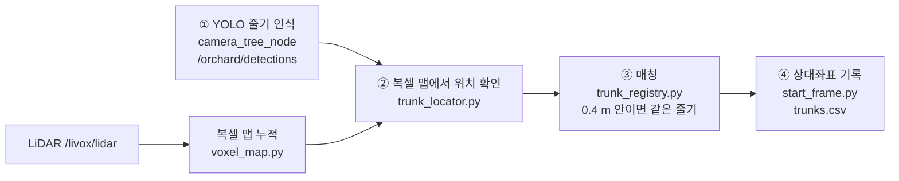

# 07. 복셀 맵 + 과수 줄기 위치 지도 (출발점 기준 상대좌표)

주행하면서 LiDAR 점군을 **복셀 맵**(3D 격자 지도)으로 쌓고, 카메라 YOLO 가 찾은 **과수 줄기**를 그 지도 위의
정확한 위치에 기록합니다. 모든 좌표는 **출발한 지점을 (0, 0, 0)** 으로 한 상대좌표입니다.

- 패키지: `ros2_ws/src/orchard_mapping/`
- 노드: `voxel_map_node` (sim.launch.py / robot.launch.py 에서 `voxel_map:=true` 가 기본)
- 결과: `data/voxel_maps/voxel_map_<날짜시각>/`

## 1. 처리 순서



1. **YOLO 인식** — 영상에서 줄기 박스를 찾습니다. 카메라는 **방향**만 알고 **거리**는 모릅니다.
2. **복셀 맵 위치 확인** — 박스 가운데 열을 카메라 광선으로 바꿔 수평 방위각을 구하고, 그 방향 쐐기 안에서
   "지면 위 0.15~0.7 m 높이에, 땅에서부터 세로로 이어진, 폭 0.45 m 이하 덩어리" 중 **가장 가까운 것**을 줄기로 확정합니다.
   거리는 LiDAR 복셀이 알려 줍니다. (잔디는 너무 낮고, 수관은 너무 높고 넓어서 걸러짐)
3. **매칭** — 이미 등록된 줄기와 0.4 m 안이면 같은 줄기로 보고 위치를 평균, 아니면 새 번호. 3 번 이상 관측된 줄기만 확정.
   저장·표시 전에 **열 위치 필터**: start 좌표 +x 가 첫 통로 방향이라 열은 x 축과 나란하므로, 확정 줄기 y 분포의 봉우리(열)에서
   `row_filter_tol`(0.4 m) 넘게 떨어진 줄기는 오검출로 보고 `trunks_rejected.csv` 로 따로 저장합니다 (Gazebo: 46개 중앙값 0.18 m → 35개 0.09 m).
4. **상대좌표** — `start` 좌표계로 저장합니다.

YOLO 모델이 아직 없으면(`detection_source: auto` 에서 검출이 안 들어오면) LiDAR 줄기 검출(`/orchard/trees`)로 ②~④ 를 대신합니다.
`trunks.csv` 의 `source` 열이 `yolo` / `lidar` 로 어느 경로인지 알려 줍니다.

## 2. 출발점 좌표계 `start`

| 축 | 의미 |
|---|---|
| 원점 (0,0,0) | 미션이 시작된 순간(FOLLOW_ROW)의 로버 위치 (`origin_trigger: first_odom` 이면 노드 시작 순간) |
| +x | **첫 통로 방향** — 전역 계획(nav_mode planner)이 추정한 통로 방향(`/orchard/row_frame`, `axis_source: row_frame`). 못 받으면(nav_mode row 등) 출발 후 처음 1.5 m 달린 **실제 이동 방향** (`course_distance`) |
| +y | 왼쪽, +z 위 (ROS REP-103 과 같은 오른손 좌표) |

왜 요(yaw) 대신 이동 방향인가: PX4 는 정지 상태에서 요 추정이 약 15° 틀어져 있다가 달리기 시작하면 바로잡힙니다.
그래서 원점은 즉시 정하되, 축 방향은 실제로 달린 방향으로 정합니다.
축이 정해지기 전(출발 후 처음 1.5 m) 받은 점군은 쌓지 않습니다. 이 구간은 다음 스캔들이 다시 덮으므로 지도에 빈 곳이 생기지 않습니다 (`start_frame.py`, `voxel_map_node.pose_start`).

RViz 에서는 `odom → start` 정적 TF 가 발행되므로 Fixed Frame 을 `start` 로 바꾸면 출발점 기준으로 보입니다.

## 3. 결과 파일

| 파일 | 내용 | 여는 방법 |
|---|---|---|
| `voxels.ply` | 복셀 중심 점군 + 높이 색 (초록 지면 → 청록 줄기 → 파랑 수관) | CloudCompare, MeshLab, Open3D |
| `voxel_map.npz` | 복셀 전체 (키, 관측 횟수, 크기) | `VoxelMap.load_npz()` |
| `trunks.csv` | `id,x,y,z,hits,mean_conf,source,first_seen,last_seen` (확정 줄기) | 엑셀, pandas |
| `trajectory.csv` | `t,x,y,z,yaw` 주행 궤적 | 엑셀, pandas |
| `trunks_by_row.csv` | 열별 표: 열, 순번, ID, x, y, 앞 나무와 간격, 관측 수, 인식 경로, 결주 의심 | 엑셀 (한글 안 깨짐) |
| `trunks_table.html` | 같은 표 + 열 요약(열 y, 그루 수, x 범위, 주간 거리, 결주 의심) | 브라우저로 열어 전체 선택 → 한글(HWP)·워드에 붙이기 |
| `trunks_table.md` | 같은 표 (마크다운) | GitHub, 노션 |
| `meta.json` | 원점의 odom 좌표, +x 방향(odom 기준 각도), 복셀 크기, 줄기 수, 열 요약 | 텍스트 |

60 초마다 자동 저장되고, 미션이 DONE 이 되거나 노드가 꺼질 때도 저장됩니다. 직접 저장:
`ros2 service call /orchard/voxel_map/save std_srvs/srv/Trigger`

표 규칙: 열 번호는 y 가 작은 쪽(출발 방향 오른쪽)부터 1, 2, …, 순번은 출발점 쪽(x 작은 쪽)부터.
같은 열 간격 중앙값의 1.6 배를 넘는 간격 앞에는 '결주 의심 n' 을 적습니다 (나무가 빠졌거나 못 본 곳).
예전 결과 폴더도 표로 만들 수 있습니다: `python3 tools/mapping/trunk_table.py data/voxel_maps/voxel_map_<날짜시각> [--truth <orchard_meta.json>]`
(`--truth` 를 주면 시뮬 정답과의 오차 열이 붙습니다).

그림으로 보기 (ROS 없이):

```bash
python3 tools/mapping/view_voxel_map.py data/voxel_maps/voxel_map_<날짜시각>
# 시뮬이면 정답과 비교: --truth ~/.cache/orchard_rover/<월드폴더>/orchard_meta.json
```

## 4. 파라미터 (`config/sim.yaml`, `config/robot.yaml` 의 `voxel_map_node`)

| 이름 | 기본 | 설명 · 조정 요령 |
|---|---|---|
| `voxel_size` | 0.1 | 복셀 한 변 [m]. 작게 하면 정밀하지만 메모리·표시가 무거움 |
| `integrate_period` | 0.5 | 점군을 이 간격 [s] 으로만 누적 |
| `max_range` | 15.0 | 이보다 먼 점 버림 [m] |
| `origin_trigger` | mission_start | 원점 시점 (`first_odom` 은 노드 시작) |
| `axis_source`, `axis_wait` | row_frame, 20 | +x 축을 전역 계획 통로 방향으로 (과수원 밖에서 비스듬히 들어와도 열과 나란). 안 오면 axis_wait 뒤 처음 달린 방향 |
| `course_distance` | 1.5 | +x 방향을 정할 직진 거리 [m] (course 방식) |
| `detection_source` | auto | `yolo` / `lidar` 로 고정 가능 |
| `min_conf` | 0.35 | YOLO 점수 하한 |
| `trunk.band_min/max` | 0.15 / 0.7 | 줄기로 볼 지면 위 높이 띠 [m]. 가지가 낮게 처진 과원은 band_max 를 낮춤 |
| `assoc_radius` | 0.4 | 같은 줄기로 합칠 거리 [m] (주간 거리 1.2 m 의 1/3) |
| `min_hits` | 3 | 확정에 필요한 관측 수 |
| `row_spacing`, `row_filter_tol` | 3.8, 0.4 | 열 위치 필터 (0 이면 끔) |
| `use_odom_drift` | true | 전역 계획이 추정한 odom 위치 흐름·요 오차(`/orchard/odom_drift`)를 빼고 쌓기 |
| `display_max_voxels` | 40000 | RViz 표시 상한 |
| `output_dir` | /workspace/data/voxel_maps | 저장 폴더 |

## 5. 코드 읽는 순서

1. `orchard_mapping/voxel_map.py` — 복셀 키 묶기(`pack`), 누적(`integrate`), 지면 높이(`ground_grid`, `height_above_ground`)
2. `orchard_mapping/start_frame.py` — 원점·축 정하기
3. `orchard_mapping/trunk_locator.py` — 박스 → 방위각(`bbox_bearing`) → 쐐기 안 줄기 찾기(`locate`)
4. `orchard_mapping/trunk_registry.py` — 매칭·확정·CSV
   `orchard_mapping/trunk_table.py` — 열별 표 (열 나누기·순번·간격·결주 의심, csv/html/md)
5. `orchard_mapping/voxel_map_node.py` — ROS 토픽 연결, TF, 표시, 저장
6. `test/test_mapping.py` — 가상 과수원 전체 흐름 시험 (중앙값 오차 < 8 cm)

시험: `cd ros2_ws/src/orchard_mapping && python3 -m pytest -q test/test_mapping.py`

## 6. 한계와 개선 과제

| 한계 | 개선 아이디어 |
|---|---|
| 요(yaw)만 반영, 롤·피치 무시 → 경사지에서 복셀이 기울어 쌓임 | `/odom` 전체 자세(쿼터니언)로 점 회전 |
| 빈 공간을 지우지 않음 → 지나간 사람 흔적이 남음 | OctoMap 식 광선 투사(센서→점 사이 칸 감소) |
| odom(GPS+IMU)을 그대로 믿음 → U턴 뒤 0.5 m 정도 어긋날 수 있음 | FAST-LIO2 같은 LiDAR-관성 오도메트리, 또는 줄기 지도로 루프 클로저 |
| 가까운 덩어리를 줄기로 봄 → 사람 다리·말뚝도 잡힐 수 있음 | YOLO 클래스 추가(post, person), 덩어리 지름 추정 |
| 복셀은 파이썬 dict → 큰 과원(수 ha)에서 느려질 수 있음 | numpy 해시 테이블, 타일 단위 저장 |

참고 논문: OctoMap (Hornung et al., 2013), YOLO (Redmon et al., 2016), FAST-LIO2 (Xu et al., 2022) — `docs/REFERENCES.md`.
