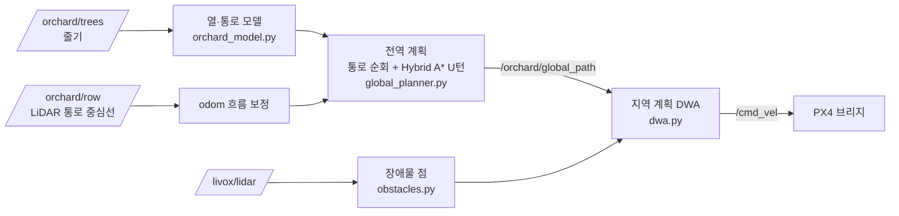

# 09. 전역·지역 경로계획 (Global / Local Path Planner)

`nav_mode:=planner` (시뮬 기본). 패키지 `ros2_ws/src/orchard_planning/`.



## 1. 두 방식 비교

| | `nav_mode:=row` (예전) | `nav_mode:=planner` (새) |
|---|---|---|
| 통로 안 | LiDAR 중심선을 Pure Pursuit 로 바로 추종 | 전역 경로(통로 중심선)를 DWA 로 추종, 중심선은 odom 보정에 사용 |
| 행 끝 U턴 | 다음 통로 추정 → Dubins → LiDAR 넘겨받기 | 같은 추정 + **Hybrid A*** (나무를 피하는 경로), 크게 벗어나면 재계획 |
| 통로 장애물 | 감속·정지 | **비켜 지나감** (못 지나가면 정지) |
| 계획 가시화 | U턴 경로 | 전역 경로, 통로 모델, 탐색 격자, DWA 후보 궤적, 장애물, 차체 |
| 실차 기본 | ✔ (robot.launch.py) | 현장 검증 후 전환 |

## 2. 전역 계획 (`global_planner.py`)

0. **출발 구간 (bootstrap)**: 처음 `bootstrap_dist`(3 m)는 LiDAR 통로 중심선을 바로 따라갑니다. PX4 는 정지 중 요가 약 15° 틀어져 있다가
   달리면서 바로잡히는데, 출발 순간 요로 열 방향을 정하면 통로 전체가 돌아간 채 계획되기 때문입니다.
   3 m 뒤 **이동 방향(GPS 위치 차)** 을 열 방향으로 정하고, 그때의 '이동 방향 − 요' 를 odom 요 오차로 둡니다.
   통로 안에서는 LiDAR 가 본 통로 방향과 모델 통로 방향의 차이로 요 오차를 계속 고치고(한 주기 최대 `yaw_step_max`),
   `/orchard/odom_drift` 의 z 로 지역 계획·복셀 맵에 보냅니다 (x, y 는 위치 흐름).
   **갱신 조건 (tracking)**: 로버가 통로 방향과 `track_heading_tol`(8°) 안, 통로 중심에서 `track_lateral_tol`(0.5 m) 안으로
   곧게 달릴 때만 요 오차·줄기 누적·열 방향을 고칩니다. 장애물을 비키는 중에는 멈춥니다 (시험: `test_planner_obstacle_with_start_yaw_error_keeps_heading`).
1. **열·통로 모델**: 달리면서 본 줄기를 0.2 m 칸에 모아 평균 → 출발 방향 기준 좌표(row frame: u 앞, v 왼쪽)에서 v 분포의 봉우리 = 열.
   출발 통로 = 통로 0, 돌 방향(`first_turn`) 쪽으로 통로 1, 2, … 각 통로 중심 = 양쪽 열의 가운데.
   열 방향은 첫 통로에서만 다듬고 고정합니다: 통로 0 에서 본 **LiDAR 통로 중심점들(odom 위치)** 에 직선을 맞춰
   (`heading_baseline` 4 m 이상 모였을 때, 출발 이동 방향에서 최대 `heading_max_change` 8°).
   중심점은 GPS 위치에서 나오므로 요 오차와 독립입니다. 예전처럼 줄기 배치로 다듬으면 줄기 위치가 요 오차로 돌려 놓은 값이라
   요 오차와 열 방향이 함께 돌아가는(둘의 차이만 보이는) 문제가 있었습니다.
2. **통로 경로**: 통로 중심선을 따라 달리는 직선. 끝을 아직 못 봤으면 로버 앞 `ahead`(10 m)까지만 잠정 경로.
   마지막 줄기에 `end_confirm_dist`(5 m) 안으로 다가왔는데 더 먼 줄기가 없으면 **행 끝 확정** → 끝 = 마지막 줄기 + `exit_margin`.
3. **U턴 (Hybrid A*)**: 통로 k 끝 → 통로 k+1 입구(그 통로 마지막 줄기 + `entry_margin`, 반대 방향).
   반경 = max(최소 회전반경, 측정 열 간격/2). 나무를 `tree_radius + robot_radius` 로 부풀린 격자에서 탐색합니다.
   빈 헤드랜드에서는 첫 단계의 Dubins 경로(반원)가 바로 답이 됩니다. 경로에서 1.5 m 넘게 벗어나면 현재 자세에서 다시 계획.
4. **진행**: `FOLLOW_ROW(k)` → 끝 도달 → `TURN` → U턴 끝 또는 거의 돌았고 LiDAR 가 새 통로를 보면 → `FOLLOW_ROW(k+1)` → … → `DONE`.
   통로 수 지정(`plan.lanes`)이어도 다음 통로의 먼 쪽 열이 전혀 안 보이면 과수원 밖으로 보고 끝냅니다. `plan.lanes: 0` 은 탐사.
5. **odom 흐름 보정**: 통로 안에서 LiDAR 중심선(`/orchard/row`, 양쪽 열 3그루 이상)과 모델 통로 중심의 차이를 odom 흐름으로 보고
   `drift_gain` 비율로 천천히 추정합니다. 경로는 흐름을 더해 odom 으로 내보내므로, PX4 odom 이 U턴 중 옆으로 흘러도 새 통로 가운데로 들어갑니다.
   RViz 상태 글자의 `odom drift` 와 빨간 화살표가 이 값입니다.

### 2-1. 과수원 진입 (`approach.py`, `plan.approach: true`, 시험 `scenario:=approach`)

과수원 밖(입구에서 10 m 안팎, 옆으로 비껴 있거나 비스듬해도 됨)에서 출발할 때 쓰는 앞 단계 `APPROACH`.

1. 최근 1.5 s 의 LiDAR 줄기를 odom 에 모아 가까운 점을 합침(같은 줄기를 여러 스캔에서 본 것).
2. 열 방향(가까운 줄기끼리 잇는 방향) → 과수원 안쪽으로 부호 결정 → 열에 수직 좌표의 봉우리 = 열(3그루 이상)
   → 이웃 열 쌍(열 간격 0.6~1.5 배) = 통로 → **끝 통로** 입구 (`approach_side`: auto 면 첫 U턴 left → 오른쪽 끝).
3. 같은 입구가 3번 이어져 보이면 목표로 삼고, 뒤로는 비슷한 추정만 천천히 반영 (가까이서 비스듬히 볼 때 생기는 90° 오판 무시).
4. 입구 3 m 앞 **정렬점**까지 Hybrid A*(줄기 부풀린 격자) 경로 → 지역 계획(DWA)이 따라감. 열이 안 보이면 천천히 직진하며 찾음,
   `approach_max_dist`(25 m) 안에 못 찾으면 멈춤.
5. 정렬점 1.5 m 안 + 통로 방향과 0.5 rad 안이면 평소 출발 절차(출발 구간 3 m)로 넘김. 출발 구간은 로버가 LiDAR 중심선과
   나란해진 뒤부터(|방향 차| < 0.12 rad) 이동 방향 기준 거리를 잰다 → 비스듬히 들어와도 열 방향이 틀어지지 않음.
6. RViz: 본 열(갈색)·고른 통로(파랑)·줄기(초록 점)·정렬점 화살표(초록)·`entrance (right end lane, N rows seen)` 글자·탐색 격자.

폐루프 시험(가상 LiDAR, 출발 요 오차 16° 포함): 출발 4 가지 × seed 2 × 요 오차 0/16° = 16 경우 모두 입구 진입 후 통로 횡오차 < 0.15 m.

## 3. 지역 계획 (`dwa.py`, `obstacles.py`)

1. **장애물 점**: LiDAR 한 스캔에서 지면 위 `obstacle.h_min~h_max` (0.2~0.75 m) 점. 잔디는 낮고, 처진 가지·수관은 차체보다 높아 빠집니다.
   지면 = RANSAC 평면 + 칸별 보정 (Mid-360 은 아래 −7° 까지만 봐서 센서 둘레 약 5 m 안 지면이 안 찍히기 때문).
2. **후보 궤적**: 곡률 21개(첫 호, `arc1` 1.5 m) × 7개(둘째 호, `arc2` 3 m). 둘째 호가 있어 '비켰다가 돌아오는' S 자를 평가합니다.
3. **충돌**: 차체를 앞뒤 원 3개(반경 0.35 m)로 덮고, 장애물과 `safety`(0.15 m) 보다 가까우면 탈락 (RViz 빨강).
4. **비용**: 경로와의 거리(가까운 미래일수록 큰 가중) + 1.5 m 앞 목표점과의 거리·방향 + 장애물 근접 + 곡률 변화.
5. **속도**: 최고 0.8 m/s, 휜 경로에서는 가로 가속도 0.15 m/s² 한계(U턴 약 0.5 m/s), 장애물이 가까우면 비례 감속, 경로 끝에서 정지.
   모든 후보가 탈락하면: 차체가 이미 `safety` 안으로 들어와 있으면 지금보다 가까워지지 않는 궤적으로 `escape_speed`(0.2 m/s)
   빠져나오기(`escape`, RViz 주황 글자), 그것도 없으면 정지(`blocked`, 빨강).

## 4. 확인 방법

```bash
ros2 launch orchard_bringup sim.launch.py scenario:=uturn                 # nav_mode 기본 planner
ros2 launch orchard_bringup sim.launch.py scenario:=obstacle              # 통로 장애물 비켜 가기
ros2 launch orchard_bringup sim.launch.py scenario:=approach              # 과수원 밖에서 입구 찾아 진입
ros2 launch orchard_bringup sim.launch.py scenario:=uturn nav_mode:=row   # 예전 방식과 비교
ros2 topic echo /orchard/local/status                                     # ok|v=0.80|w=-0.02|clear=1.20
```

Gazebo 없이: `cd ros2_ws/src/orchard_planning && python3 -m pytest -q test/`

## 5. 파라미터 조정 요령

| 증상 | 조정 |
|---|---|
| 통로 안에서 좌우로 흔들림 | `dwa.goal_lookahead` 늘리기 (1.5 → 2.0), `dwa.w_smooth` 늘리기 |
| U턴 뒤 새 통로 가운데로 늦게 붙음 | `dwa.goal_lookahead` 줄이기, `plan.drift_gain` 늘리기 |
| 장애물 옆을 너무 붙어 지나감 | `dwa.safety`, `dwa.obstacle_influence` 늘리기 (너무 크면 좁은 통로에서 멈춤) |
| 처진 가지 때문에 멈춤 | `obstacle.h_max` 를 차체 높이 + 5~10 cm 로 |
| U턴이 나무에 너무 가까움 | `plan.exit_margin`·`entry_margin`, `plan.tree_radius` 늘리기 |
| 장애물 비킨 뒤 경로가 통째로 돌아감 (RViz 통로 선이 열과 비스듬) | `plan.track_heading_tol` 줄이기, `plan.yaw_step_max` 줄이기 |
| 나무 옆에 붙어 `blocked` 로 멈춤 | `dwa.escape_speed`·`escape_margin` 확인, `dwa.safety` 줄이기 |
| U턴 경로가 없다고 나옴 (Dubins 대체) | 헤드랜드가 좁음 → `plan.min_turn_radius` 확인, K-턴(후진) 필요 |

## 6. Gazebo 결과

| 시나리오 | 결과 |
|---|---|
| `uturn` (3열, 통로 2개) | 두 통로 + U턴 완주, 통로 안 횡오차 RMS 2.7 cm |
| `obstacle` (2열, 통로 가운데 사람) | 사람을 비켜 통과, 차체와 장애물 최소 여유 0.17 m |
| `approach` (3열, 과수원 밖 출발) | 입구를 찾아 통로 0 진입, 통로 횡오차 RMS 3.0 cm |
| 전체 과수원 (6열 × 30 m, 장애물 3개, 과수원 밖 출발, 탐사) | 통로 5개·U턴 4번 완주, 횡오차 RMS 3.4 cm / 최대 8.4 cm (장애물 ±4 m 밖) |

출발 요 오차 16° + 통로 장애물 폐루프 시험: `test_planner_obstacle_with_start_yaw_error_keeps_heading`.

## 7. 한계와 개선 과제

- 전진만 합니다 (PX4 로버 Offboard 속도 벡터). 헤드랜드가 좁으면 Reeds-Shepp(후진 포함) 경로가 필요합니다.
- 전역 계획은 나무만 장애물로 봅니다. 헤드랜드의 울타리·차량은 지역 계획이 피하거나 멈춥니다 → 복셀 맵을 전역 격자에 넣기.
- 흐름 보정은 통로 가로 방향(v)만 합니다. 앞뒤(u) 흐름은 줄기 번호 매칭으로 보정할 수 있습니다.
- DWA 는 곡률 고정 호 2개라 아주 좁은 틈은 못 찾을 수 있습니다 → 격자 기반 지역 계획(TEB, MPPI 등)과 비교해 보기.

참고: Hybrid A* — D. Dolgov et al., IJRR 29(5), 2010 · DWA — D. Fox, W. Burgard, S. Thrun, IEEE RAM 4(1), 1997 ·
Boustrophedon 커버리지 — H. Choset, Autonomous Robots 9, 2000 ([REFERENCES](REFERENCES.md)).
