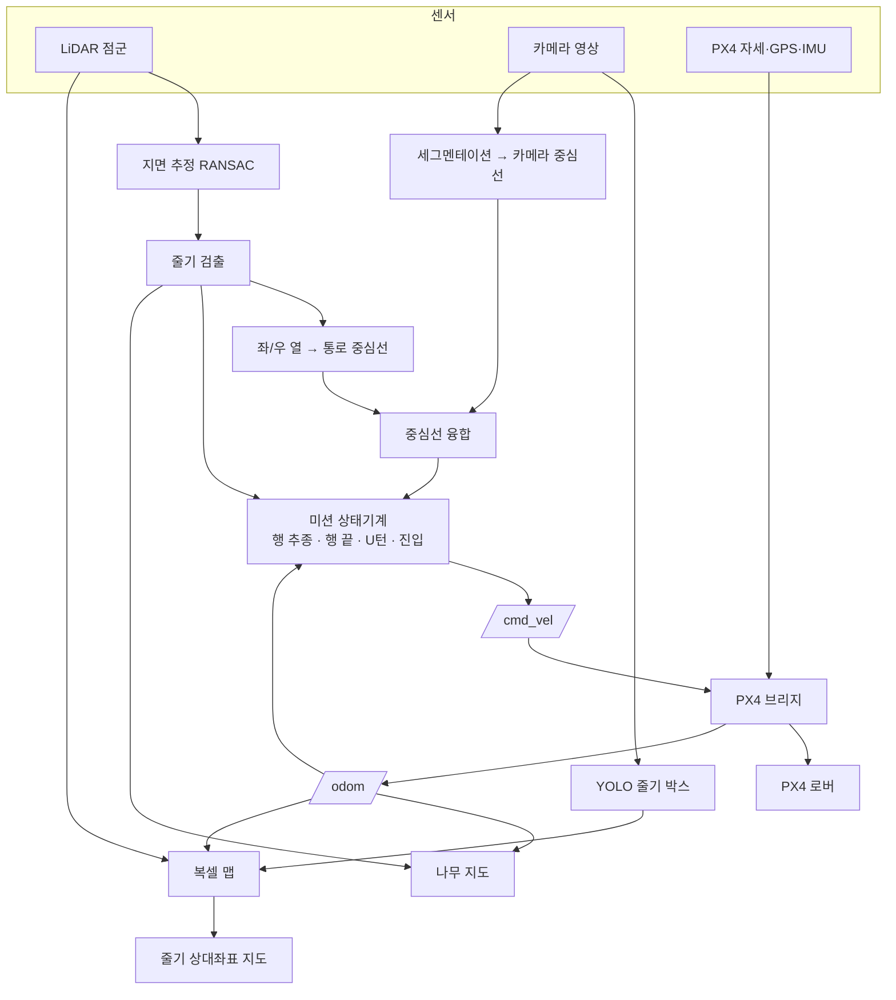

# 과수원 자율주행 로버 학생 매뉴얼

UNIST BTS 유니주행차 · orchard-rover · 2026-09-26 판 · 개발 GitHub @pathcmd95 (pathcmd@gmail.com)

이 매뉴얼은 **처음 온 학생이 혼자서** 환경을 준비하고, 시뮬레이션을 돌려 보고, 코드를 읽고 고쳐서, 고친 것이 좋아졌는지 확인하는 데까지 가도록 쓰였습니다.
주제별 세부 문서(`docs/01`~`09`)와 각 패키지 폴더의 `README.md` 로 이어지는 길잡이 역할도 합니다.

## 목차

0. 이 매뉴얼 사용법
1. 배경과 용어
2. 준비: 컴퓨터, Docker, 이미지
3. 첫 실행 (따라 하기)
4. 전체 구조 이해하기
5. 기능별 설명 (알고리즘 · 코드 위치 · 파라미터 · 확인 방법 · 개선 과제)
6. 코드를 고치는 방법 (작업 순서와 실습 예제)
7. 데이터 수집과 학습 (YOLO, 세그멘테이션)
8. 실차(Jetson Orin)로 옮기기
9. 성능 지표와 실험 설계
10. 문제 해결
11. 학생 과제 목록
12. 참고: 외부 코드 저장소와 논문
부록 A. 자주 쓰는 명령 / B. launch 인자 / C. 결과 파일

---

## 0. 이 매뉴얼 사용법

목표는 **"돌려 보고 → 이해하고 → 고치고 → 확인한다"** 입니다.

| 단계 | 읽을 곳 | 걸리는 시간 |
|---|---|---|
| 환경 준비 | 2장 (+ `docs/01_install.md`, `docs/08_docker_share.md`) | 공유 이미지 30분 / 직접 빌드 1~2시간 |
| 첫 실행 | 3장 | 30분 |
| 구조 파악 | 4장, 루트 `README.md` 의 코드 지도 | 1시간 |
| 관심 기능 공부 | 5장의 해당 절 → 그 패키지 `README.md` → 소스 파일 맨 위 설명 | 기능당 1~3시간 |
| 수정·검증 | 6장, 9장 | 과제마다 |

코드를 읽을 때 요령:

- 모든 소스 파일 맨 위에는 **무엇을 하는 파일인지, 입력·출력, 주요 파라미터, 참고 논문**이 한국어로 적혀 있습니다. 먼저 이것부터 읽으세요.
- 계산은 **ROS 없는 순수 파이썬 모듈**(예: `controller.py`, `rows.py`, `voxel_map.py`)에 있고, `*_node.py` 는 ROS 토픽을 연결만 합니다.
  그래서 알고리즘은 노트북에서 `pytest` 로 바로 시험할 수 있습니다. 고칠 때도 대부분 순수 모듈을 고칩니다.
- 이 저장소에서 수정한 모든 파이썬 파일에는 함수마다 설명(docstring)과 주석이 달려 있습니다.

---

## 1. 배경과 용어

### 1-1. 무엇을 만드나

울산 애플팜 같은 **밀식 사과 과원**(M9 왜성대목, 행간 약 3.8 m, 주간 약 1.2 m)에서
로버가 사람 없이 **통로를 따라 달리고, 행 끝에서 돌아 다음 통로로 들어가며**, 지나가면서 **나무 하나하나의 위치를 지도로 남기는** 것이 목표입니다.
이 지도는 결주(빈 자리) 확인, 생육 조사, 방제 경로 계획 등에 쓰입니다.

### 1-2. 하드웨어

| 장치 | 역할 | 이 저장소에서의 이름 |
|---|---|---|
| Livox Mid-360 | 360°×59° 3D LiDAR, 10 Hz. 줄기·열·지면·장애물 인식의 주 센서 | `/livox/lidar`, 프레임 `livox_frame` |
| Intel RealSense D455 | 컬러 카메라 (깊이는 현재 안 씀). YOLO 줄기 검출, 세그멘테이션 | `/camera/color/*`, 프레임 `camera_color_optical_frame` |
| Pixhawk + PX4 v1.17 | 오토파일럿. 모터·조향 제어, GPS·IMU 융합(EKF) 자세 추정 | `/fmu/*` 토픽 |
| Jetson Orin | 탑재 컴퓨터 (JetPack 7.2 = Ubuntu 24.04) | robot 이미지 |
| 차체 | Ackermann(자동차식 앞바퀴 조향). 시뮬은 PX4 `rover_ackermann` (휠베이스 0.5 m) | `base_link` |

### 1-3. 용어

| 용어 | 뜻 |
|---|---|
| 열(row) | 나무가 한 줄로 심긴 줄 |
| 통로(lane) | 두 열 사이 로버가 달리는 길. 열이 N 개면 통로는 N−1 개 (바깥 통로 제외) |
| 행간 / 주간 | 열과 열 사이 거리 / 같은 열에서 나무와 나무 사이 거리 |
| 헤드랜드(headland) | 열 끝 바깥, 로버가 U턴하는 빈 땅 |
| 줄기(trunk) | 나무 밑동. 지면 위 0.2~0.7 m 는 가지·잎이 없어 LiDAR·카메라로 찾기 쉬움 |
| 결주 | 심겨야 할 자리에 나무가 없는 곳 |
| 통로 중심선 | 좌·우 열의 가운데 선. 로버가 따라갈 목표 |
| 횡오차 | 로버가 통로 중심선에서 옆으로 벗어난 거리 (성능 지표) |
| ROS 2 노드/토픽 | 프로그램 하나 / 노드 사이에 오가는 메시지 통로 (예: `/cmd_vel`) |
| TF | 좌표계 사이 변환 트리 (`odom → base_link → livox_frame`) |
| `base_link` | 로버 몸체 좌표계. x 전방, y 왼쪽, z 위 |
| `odom` | PX4 EKF 가 추정한 로버 위치의 기준 좌표계 (시뮬: 스폰 위치가 원점) |
| `start` | **출발점 기준 상대좌표계**. 미션을 시작한 곳이 (0,0,0), 처음 곧게 달린 방향이 +x (복셀 맵·줄기 지도) |
| NED / ENU | PX4 좌표(북-동-아래) / ROS 좌표(동-북-위). `orchard_px4_bridge/frames.py` 가 변환 |
| SITL | Software In The Loop. PX4 펌웨어를 PC 에서 시뮬레이터와 함께 돌림 |
| RTF | Real Time Factor. 시뮬 시간 / 실제 시간. 맥에서 약 5 % (시뮬 1초에 실제 20초) |
| Offboard | PX4 가 외부 컴퓨터(ROS)의 속도 명령을 따르는 모드 |

---

## 2. 준비: 컴퓨터, Docker, 이미지

### 2-1. 컴퓨터

| 구분 | 권장 | 비고 |
|---|---|---|
| 개발 PC | Ubuntu 24.04, NVIDIA GPU(예: RTX 3080), 메모리 32 GB, 디스크 여유 100 GB | Gazebo 가 실시간에 가깝게 돎 |
| 맥 | Apple Silicon, 메모리 16 GB 이상, Docker Desktop 메모리 12 GB·디스크 80 GB 이상 | 화면 없이(가상 화면) 녹화 방식. RTF 약 5~10 % |
| 노트북(시험만) | Python 3.10+, numpy, pytest | `./scripts/test_ws.sh` 로 알고리즘 시험 가능 |

### 2-2. Docker 설치

Ubuntu 는 `docs/01_install.md` 2절(Docker Engine + NVIDIA Container Toolkit), 맥·윈도는 Docker Desktop 을 설치하고 메모리를 12 GB 이상으로 올립니다 (`docs/01_install.md` 2-1절).
모든 개발은 Docker 컨테이너 안에서 합니다 — 누구 컴퓨터에서나 같은 버전(Ubuntu 24.04, ROS 2 Jazzy, PX4 v1.17.0, Gazebo Harmonic)이 보장됩니다.

### 2-3. 저장소 받기

```bash
git clone https://github.com/pathcmd95/orchard-rover.git
cd orchard-rover
```

### 2-4. 이미지 준비 — 둘 중 하나

**(권장) 완성 이미지 받기** — ghcr.io 에 amd64·arm64 가 올라가 있습니다 (`ghcr.io/pathcmd95/orchard-rover:sim-full`). 자세히는 `docs/08_docker_share.md`.

```bash
./scripts/docker_share.sh pull                                        # ghcr.io 에서 받기 (권장)
./scripts/docker_share.sh load orchard-rover_sim-full_amd64.tar.gz    # 파일로 받았을 때
```

**직접 빌드** — 30~90분.

```bash
./scripts/docker_build.sh sim
```

> 자기 컴퓨터 CPU 종류와 같은 이미지를 받아야 합니다: 일반 PC = `amd64`, Apple Silicon 맥 = `arm64`.

### 2-5. 모델 파일

시뮬레이션 데이터로 학습한 시험용 모델(ONNX)이 `models/` 에 들어 있습니다. 새로 학습하면 같은 이름으로 바꿔 넣으세요.

| 파일 | 용도 | 없으면 |
|---|---|---|
| `models/orchard_seg.onnx` | 카메라 세그멘테이션 (주행가능 영역) | 카메라 중심선 꺼짐, LiDAR 만으로 주행 |
| `models/trunk_yolo.onnx` | 카메라 YOLO 줄기 검출 | 카메라 검출 꺼짐. 복셀 줄기 지도는 LiDAR 줄기로 대신 |

완성 이미지(`sim-full`)에는 만들 당시의 `models/` 가 들어 있습니다.

---

## 3. 첫 실행 (따라 하기)

### 3-1. 리눅스 PC (화면 있음)

```bash
./scripts/docker_run.sh sim                     # 컨테이너 진입 (받은 완성 이미지만 있으면 자동으로 그것을 씀)
./scripts/build_ws.sh                           # ROS 워크스페이스 빌드 (처음, 또는 파일 추가 후)
source ros2_ws/install/setup.bash
ros2 launch orchard_bringup sim.launch.py scenario:=follow
```

1~2분 뒤 Gazebo 창과 RViz 창이 뜨고, 5초(시뮬 시간) 뒤 로버가 스스로 출발합니다.

### 3-2. 맥 (화면 녹화 방식)

맥 Docker 에는 화면이 없어서, 컨테이너 안 가상 화면에 Gazebo·RViz 를 띄우고 **녹화**합니다.

1. `scripts/demo.env` 를 만들거나 고칩니다 (git 에 안 올라가는 개인 설정):
   ```
   DURATION=1200
   FPS=10
   TAIL=20
   LAUNCH_ARGS="scenario:=follow camera_lite:=true"
   ```
2. 터미널에서 `./scripts/gazebo_demo_job.sh` (또는 Finder 에서 `run_gazebo_demo.command` 더블클릭). 받은 완성 이미지(`orchard-rover:sim-full`)를 자동으로 씁니다.
   한 번 만든 뒤에는 Docker Desktop 에서 `bts_sils` 컨테이너 ▶(Start) 로 다시 돌릴 수 있습니다.
3. 끝나면 `data/media/gazebo_<날짜시각>/` 에 `gazebo.mp4`, `rviz.mp4`, `lane_error.txt`(횡오차), `errors.txt`(오류 요약).

### 3-3. 무엇을 봐야 하나 (RViz)

| 표시 | 뜻 |
|---|---|
| 점군 | Livox Mid-360 |
| 갈색 원기둥 | 이번 프레임에서 찾은 줄기 |
| 초록 선 두 개 / 노란 선 | 좌·우 열 직선 / 통로 중심선 |
| 빨간 상자 | 통로 안 장애물 |
| 초록 굵은 선 | 전역 경로 (`/orchard/global_path`, planner 모드) |
| 초록/빨강 가는 선 다발, 노란 선 | DWA 후보 궤적 (빨강 = 장애물로 탈락), 고른 궤적 |
| 주황 상자, 파란 원 3개 | 지역 계획이 본 장애물 점, 차체 근사 원 |
| 갈색 선·하늘색 선·`lane k` | 전역 계획의 열·통로 모델, 반투명 격자 = U턴 탐색 격자 |
| 하늘색 선 (row 모드) | 계획한 U턴 경로 (`/orchard/turn_path`) |
| 초록 원기둥 + `R열-T번호` | 나무 지도 (빨간 공 = 결주 후보) |
| 초록~파랑 격자 | 복셀 맵 (높이 색: 초록 지면 → 파랑 수관) |
| 주황 원기둥 + `T번호` | 복셀 맵에 매핑된 줄기 (주황 = YOLO 확인, 회색 = LiDAR 만) |
| 영상 패널 | 세그멘테이션 색 영상, LiDAR 줄기를 투영한 박스 |

터미널에서 확인:

```bash
ros2 topic echo /orchard/mission/state           # FOLLOW_ROW|lanes_done=0|…|row=fused
ros2 topic echo /orchard/row --once              # 중심선 offset, heading, 행 폭
ros2 topic hz /livox/lidar                       # 약 10 Hz (시뮬 시간 기준)
```

### 3-4. 끄기와 결과

`Ctrl+C` 한 번. 결과는 호스트의 저장소 `data/` 아래에 남습니다 (부록 C).

### 3-5. 짧은 구간 시험

전체 과수원(6열 × 30 m)을 다 돌면 맥에서 1시간 넘게 걸립니다. 개발할 때는 **구간 시험**을 씁니다.

| `scenario:=` | 확인하는 것 | 맥에서 대략 |
|---|---|---|
| `follow` | 통로 하나 따라가기, 횡오차 | 5분 |
| `uturn` | 행 끝 → U턴 → 다음 통로 진입 | 5~10분 |
| `edge` | 탐사: 끝 열 판정 → DONE, 나무 지도 | 5~10분 |
| `obstacle` | 통로 장애물 비켜 가기 (`nav_mode:=row` 는 감속·정지) | 5분 |
| `approach` | 과수원 밖 출발 → 입구 찾기 → 통로 진입 | 5~10분 |

전체 과수원 시험(루트 `README.md` 시연 영상과 같은 설정, 맥 약 45분):
`explore:=true obstacles:=3 approach:=true spawn_x:=-9.0 spawn_y:=-3.5 spawn_yaw:=0.35 camera_lite:=true`

---

## 4. 전체 구조 이해하기

### 4-1. 데이터 흐름



한 문장으로: **LiDAR 가 통로와 나무를 찾고 → 미션이 어디로 갈지 정하고 → PX4 가 바퀴를 굴리며 → 지도 노드들이 본 것을 기록합니다.** 카메라는 LiDAR 를 보완하고, 지도에 "YOLO 로 확인한 나무" 표시를 더합니다.

### 4-2. ROS 2 에서 알아야 할 최소한

| 개념 | 이 저장소에서 예 | 확인 명령 |
|---|---|---|
| 노드 | `lidar_tree_node`, `row_navigator_node` | `ros2 node list` |
| 토픽 | `/orchard/row`, `/cmd_vel` | `ros2 topic list`, `ros2 topic echo <토픽>` |
| 메시지 형식 | `orchard_msgs/RowCenterline` | `ros2 interface show orchard_msgs/msg/RowCenterline` |
| 서비스 | `/orchard/mission/stop` | `ros2 service call /orchard/mission/stop std_srvs/srv/Trigger` |
| 파라미터 | `follow.lookahead` | `ros2 param get /row_navigator_node follow.lookahead` |
| launch | `sim.launch.py` | 여러 노드를 한 번에, 파라미터 파일과 함께 실행 |
| TF | `odom → base_link → livox_frame` | `ros2 run tf2_ros tf2_echo base_link livox_frame` |
| 시뮬 시간 | `use_sim_time: true` | 모든 노드가 Gazebo `/clock` 을 따름 |

### 4-3. 좌표계

```
start ──(정적, voxel_map_node)──▶ odom ──(PX4 EKF, state_node)──▶ base_link ─┬─▶ livox_frame
                                                                               └─▶ camera_link ─▶ camera_color_optical_frame
```

- 인식 결과(`/orchard/trees`, `/orchard/row`)는 **base_link** 기준 → "로버에서 봤을 때 어디".
- 나무 지도(`orchard_mapper_node`)는 **odom** 기준 + GPS 로 위경도.
- 복셀 맵·줄기 지도(`voxel_map_node`)는 **start** 기준 → "출발점에서 몇 m".
- 센서 장착 위치(base_link → 센서)는 `orchard_description/config/rover.yaml` **한 곳**에서만 정합니다.

### 4-4. 패키지 구성

| 패키지 | 역할 | README |
|---|---|---|
| `orchard_perception` | 인식 | `ros2_ws/src/orchard_perception/README.md` |
| `orchard_navigation` | 주행·미션·나무 지도 | `ros2_ws/src/orchard_navigation/README.md` |
| `orchard_mapping` | 복셀 맵·줄기 상대좌표 | `ros2_ws/src/orchard_mapping/README.md` |
| `orchard_planning` | 전역(통로 순회·Hybrid A*)·지역(DWA) 경로계획 | `ros2_ws/src/orchard_planning/README.md` |
| `orchard_px4_bridge` | ROS ↔ PX4 | `ros2_ws/src/orchard_px4_bridge/README.md` |
| `orchard_gazebo` | 시뮬 월드·모델·평가 | `ros2_ws/src/orchard_gazebo/README.md` |
| `orchard_description` | URDF, 센서 위치 | `ros2_ws/src/orchard_description/README.md` |
| `orchard_msgs` | 전용 메시지 | `ros2_ws/src/orchard_msgs/README.md` |
| `orchard_bringup` | launch, 파라미터, RViz | `ros2_ws/src/orchard_bringup/README.md` |

### 4-5. 설계 원칙 (고칠 때 지킬 것)

1. **계산은 순수 모듈, ROS 는 노드.** 새 알고리즘은 ROS 없이 시험할 수 있게 순수 함수·클래스로 만들고 노드에서 부릅니다.
2. **파라미터는 yaml 에.** 숫자를 코드에 박지 말고 `declare_parameter` + `config/sim.yaml`·`robot.yaml` 에 설명과 함께 적습니다.
3. **센서 위치는 `rover.yaml` 한 곳.**
4. **고친 뒤엔 단위 시험 → 구간 시험.** 좋아졌다는 근거(횡오차, 지도 오차 등 숫자)를 남깁니다.

---

## 5. 기능별 설명

각 절은 **목적 → 코드 위치 → 알고리즘 단계 → 주요 파라미터 → 확인 방법 → 개선 과제** 순서입니다.
파라미터는 특별한 말이 없으면 `ros2_ws/src/orchard_bringup/config/sim.yaml`(시뮬) / `robot.yaml`(실차)에 있습니다.

### 5-1. LiDAR 지면 · 줄기 · 통로 중심선

**목적** 점군에서 나무 줄기를 찾고, 좌·우 열 사이 통로 중심선과 통로 안 장애물 거리를 매 프레임 계산합니다.

**코드** `orchard_perception/lidar_tree_node.py` → `ground.py` → `trunks.py` → `rows.py`

**알고리즘**

1. 점군을 TF 로 `base_link` 에 옮기고, 관심영역(`roi.*`) 밖과 차체 자기 점(`self_filter.*`)을 버립니다.
2. **지면 추정 (RANSAC)**: `ground.nominal_z ± search_band` 안의 점에서 무작위로 3점을 골라 평면을 만들고, 거리 `distance_threshold` 안의 점(인라이어)이 가장 많은 평면을 고릅니다. 기울기가 `max_tilt_deg` 보다 크거나 인라이어가 적으면 평지 가정으로 대체합니다. (Fischler & Bolles, 1981)
3. **줄기 검출**: 각 점의 지면 위 높이(HAG)를 구해 `trunk.band_min~band_max`(0.25~0.7 m) 사이 점만 남깁니다. 잔디는 너무 낮고 수관은 너무 높아 빠집니다. 남은 점을 xy 격자(`cell_size`)로 묶어 연결 요소(union-find)로 군집을 만들고, 점 수·지름·높이 범위로 줄기가 아닌 것을 거릅니다.
4. **열·중심선**: 줄기를 왼쪽/오른쪽으로 나눠 **기울기를 공유하는 두 평행 직선**을 가중 최소제곱으로 맞춥니다 (행은 평행하다는 사실을 이용). 잔차가 큰 줄기는 이상점으로 빼고 다시 맞춥니다. 두 직선의 가운데가 통로 중심선입니다.
5. **평활**: `RowTracker` 가 지수이동평균(`smoothing_alpha`)으로 흔들림을 줄이고, 잠깐 못 찾으면 `hold_time` 동안 이전 값을 유지합니다.
6. **통로 장애물**: 중심선 ± `obstacle.half_width` 안, 지면 위 `h_min~h_max` 높이의 점 중 가장 가까운 x 거리.

**주요 파라미터** `ground.nominal_z`(★실차 실측), `trunk.band_min/max`, `trunk.max_diameter`, `row.expected_width`(★과수원마다), `row.max_residual`, `row.smoothing_alpha`, `obstacle.*`

**확인** RViz 갈색 원기둥·초록 선·노란 선. `ros2 topic echo /orchard/row --once` 의 `confidence`, `left_count`, `right_count`.
Gazebo 없이: `python3 tools/sim_checks/world_lidar_check.py`. 단위 시험: `test_ground.py`, `test_rows.py`.

**개선 과제** 경사·요철에서 평면 대신 격자별 지면(예: 지면 격자 + 보간), 한쪽 열만 보일 때 중심선 추정, 줄기 반경 추정으로 수령 추정.

### 5-2. 카메라 YOLO 줄기 검출과 자동 라벨링

**목적** 카메라로 줄기를 찾아 LiDAR 결과를 확인하고, 복셀 줄기 지도에 "YOLO 확인" 표시를 합니다.
사람이 라벨링하지 않아도 되도록 **LiDAR 줄기를 영상에 투영해 학습 라벨을 자동으로 만듭니다.**

**코드** `camera_tree_node.py`(추론) → `yolo.py`(전처리·후처리) / `tree_fusion_node.py` + `projection.py`(투영·매칭·라벨 저장)

**알고리즘**

1. `camera_tree_node`: 영상을 정사각형으로 늘리지 않고 여백(letterbox, 회색 114)을 붙여 `input_size` 로 맞춘 뒤 ONNX 모델에 넣고, 점수(`conf_threshold`) 이상 박스를 NMS 로 겹침 제거해 `/orchard/detections` 로 냅니다.
2. `tree_fusion_node`: LiDAR 줄기(base_link)를 카메라 광학 좌표로 옮겨 핀홀 모델로 영상에 투영, 줄기 높이만큼 박스를 만듭니다. YOLO 박스와 IoU·수평 겹침으로 짝을 지어 `camera_confirmed` 표시.
3. `record_dataset:=true` 이면 영상과 투영 박스를 YOLO 형식(`labels/*.txt`, 클래스 0 = trunk)으로 저장 → `data/orchard_dataset_sim/`.

**주요 파라미터** `camera_tree_node.model_path`(또는 launch `camera_model:=`), `input_size`(학습 `imgsz` 와 같게. 시뮬 `camera_lite` 는 320), `conf_threshold`, `nms_threshold` / `tree_fusion_node.record_dataset`, `record_every_n`, `max_label_distance`

**확인** RViz 영상 패널 `/orchard/debug/detections`(YOLO 박스), `/orchard/debug/fusion`(초록 = 매칭, 주황 = 미매칭, 파랑 = YOLO).
단위 시험: `test_yolo_runtime.py`, `test_projection.py`.

**개선 과제** 현장 영상 수집·라벨 검수 후 혼합 학습, 클래스 추가(지주 `post`, 사람 `person`), Orin 에서 TensorRT 가속.

### 5-3. 주행가능 영역 세그멘테이션 (카메라 중심선)

**목적** 카메라 영상의 픽셀을 7개 클래스(주행가능 / 나무 밑 띠 / 나무 / 구조물 / 장애물 / 배경 / 하늘)로 나누고, 주행가능 영역의 가운데를 카메라 중심선으로 만들어 LiDAR 중심선과 섞습니다.

**코드** `seg_path_node.py` → `seg_model.py`(ONNX 추론) → `seg_path.py`(지면 역투영·중심선) / 융합은 `orchard_navigation/fusion.py`

**알고리즘** 모델(LR-ASPP + MobileNetV3-Small, 입력 320×240)이 라벨 영상을 만들면, 주행가능 픽셀의 광선을 지면 평면(`ground_z`)과 만나는 점으로 바꿔(역투영) base_link 의 xy 점들로 만듭니다. x 구간별 좌우 끝의 가운데를 이어 직선으로 맞춘 것이 카메라 중심선입니다. 주행 노드는 LiDAR 가 좋으면 LiDAR 위주, LiDAR 가 약하면 카메라 비중을 높입니다 (`/orchard/mission/state` 의 `row=lidar|fused|camera`).

**학습** Gazebo 세그멘테이션 카메라가 정답 라벨을 주므로 `record_seg:=true` 로 데이터를 모아 `tools/training/train_segmentation.py` 로 학습 (7장).
현재 모델: Gazebo 검증 주행가능 IoU 0.925, mIoU 0.432 (장애물·배경 클래스 약함).

**확인** RViz `/orchard/debug/seg`. `seg_gt:=true` 로 정답 라벨을 넣으면 모델 없이 기하 계산만 시험할 수 있습니다.

**개선 과제** 장애물·배경 데이터 보강, 현장 데이터 미세조정, 중심선 대신 주행가능 영역 전체로 경로 계획.

### 5-4. 행 추종 (Pure Pursuit) — `nav_mode:=row` (예전 방식, 실차 기본)

**목적** 통로 중심선을 부드럽게 따라가도록 속도·회전 명령(`/cmd_vel`)을 만듭니다.

**코드** `orchard_navigation/controller.py`

**알고리즘** 로버 앞 `lookahead` 거리에 있는 중심선 위 목표점을 잡고, 로봇 원점과 그 점 (x=L, y) 를 지나는 원호의 곡률 κ = 2·y / (L² + y²) 로 회전합니다 (Coulter, 1992). 요레이트 = 속도 × κ, 최소 회전반경과 `max_yaw_rate` 로 제한합니다.
속도는 인식 신뢰도가 낮으면 `min_speed` 쪽으로, 통로 장애물이 `slow_distance` 안이면 줄이고 `stop_distance` 안이면 0.

**주요 파라미터** `follow.cruise_speed`(0.8 m/s), `follow.lookahead`(2.5 m), `follow.min_turn_radius`(0.9 m), `stop_distance`, `slow_distance`

**확인** `lane_error_monitor` 로그 "통로 중심선 횡오차: RMS x cm, 최대 y cm" (맥 녹화는 `lane_error.txt`). 현재 1.4~2.5 cm RMS.
단위 시험: `test_controller.py`, 폐루프 `test_closed_loop.py`.

**개선 과제** lookahead 를 속도에 비례(적응형), MPC(모델 예측 제어)와 비교, 경사에서 속도 제어.

### 5-5. 미션 상태기계와 탐사 — `nav_mode:=row`

**목적** 통로 하나를 끝내면 돌아서 다음 통로로 들어가고, 정한 통로 수(또는 과수원 끝)까지 반복합니다.

**코드** `orchard_navigation/mission.py` (`OrchardMission.step` 을 20 Hz 로 호출), 노드 `row_navigator_node.py`

**상태**

```
IDLE ─start→ FOLLOW_ROW ─행 끝→ EXIT_ROW ─exit_distance 주행→ TURN ─180°→ ENTER_ROW ─행 인식→ FOLLOW_ROW …
                                    └─ 마지막 통로면(또는 탐사 모드에서 끝 열 도달) ─────────→ DONE
어느 상태든 stop() → STOPPED,  ENTER_ROW 에서 6 m 안에 통로를 못 찾으면 → STOPPED(안전정지)
```

- **행 끝 판단**: 앞쪽 마지막 줄기의 x 가 `end_trigger_x` 보다 작아지는 상태가 `end_confirm_frames` 연속이면 행 끝 (최소 `min_row_travel` 달린 뒤).
- **탐사 모드**(`lanes: 0`, `explore:=true`): U턴 뒤 들어가려는 통로의 먼 쪽에 열이 없으면 과수원 끝 열 바깥이라 보고 DONE.

**확인** `/orchard/mission/state` 예: `TURN|lanes_done=1|U턴 (계획: 다음 통로 …, 줄기 관측 5+4, …)|row=lidar`

**개선 과제** 좁은 헤드랜드용 K-턴(전진·후진), 건너뛸 통로 지정, GPS 경유점으로 과수원 진입·복귀.

### 5-6. 행 끝 U턴 계획 (Dubins 경로) — `nav_mode:=row`

**목적** 행 끝에서 다음 통로 입구를 정확히 찾아 들어갑니다. 반원만 도는 방식(`arc`)은 행간 파라미터가 틀리거나 잔디에서 미끄러지면 입구를 빗나갑니다.

**코드** `orchard_navigation/headland.py` (`estimate_next_lane`, `dubins_path`, `PathTracker`), `mission.py` (`add_trees`, `_plan_turn`)

**알고리즘**

1. 주행 중 본 줄기를 odom 좌표로 모아 둡니다 (`add_trees`).
2. 행 끝에서 돌 방향 쪽 **가까운 열**과 **그 너머 열**을 찾아, 두 열의 가운데를 다음 통로 중심선, 두 열 마지막 나무 + `entry_margin`(0.8 m)을 입구로 정합니다.
   너머 열이 안 보이면 가까운 열 + 파라미터 간격/2, 줄기를 못 봤으면 파라미터 간격으로 대신합니다.
3. 현재 자세 → 입구(반대 방향)까지 **Dubins 경로**: 최소 회전반경 r 로 전진만 할 때 가장 짧은 길은 "원호-직선-원호" 또는 "원호-원호-원호" 6가지(LSL, RSR, LSR, RSL, RLR, LRL) 중 하나입니다 (Dubins, 1957). 각 경우의 길이를 닫힌 식(Shkel & Lumelsky, 2001)으로 계산해 가장 짧은 것을 고릅니다. r = 측정한 행간/2 (최소 0.9 m).
4. 경로를 Pure Pursuit(`turn_lookahead` 1.0 m)로 따라갑니다. `max_turn_deviation`(1.2 m) 넘게 벗어나면 안전정지.
5. **LiDAR 넘겨받기**: 거의 다 돌아(180° 에서 `handover_angle` 0.6 rad 안) LiDAR 가 새 통로를 보고 중심에서 크게 벗어나지 않았으면 경로 대신 LiDAR 중심선을 따릅니다. PX4 odom 이 U턴 중 0.5~1 m 옆으로 밀리기 때문입니다.

**확인** RViz 하늘색 선 `/orchard/turn_path`, `scenario:=uturn`. 폐루프 시험(간격 3.4 m 인데 파라미터 3.8 + 회전 20 % 덜 됨): 입구 횡오차 planned 0.08 m / arc 1.35 m.

**개선 과제** Reeds-Shepp(후진 포함) 경로, 헤드랜드 폭 제한(울타리) 반영, U턴 중 LiDAR 로 odom 보정.

### 참고: 두 가지 주행 방식

시뮬 기본은 **`nav_mode:=planner`** (5-10 전역·지역 경로계획), 실차 기본은 현장 검증 전까지 **`nav_mode:=row`** (5-4~5-6) 입니다.
두 방식 모두 `/orchard/mission/state` 를 같은 형식으로 내므로 나무 지도·복셀 맵 노드는 그대로 동작합니다.

### 5-7. 나무 지도 (열 · 번호 · 결주)

**목적** 과수원 전체의 나무 목록 — "몇 번째 열 몇 번째 나무가 어디 있고, 어디가 비었는지".

**코드** `orchard_navigation/orchard_mapper_node.py`, `treemap.py`

**알고리즘**

1. 매 프레임 줄기(base_link)를 **검출 시각의 odom 자세로 보간**해 odom 좌표로 옮깁니다 (`PoseHistory`).
2. 가까운 관측을 하나의 나무로 합칩니다 (`assoc_radius`, `min_hits`).
3. **보정**: 곧게 달릴 때 "이동 방향 − 자세 요" = 방위 오차로 추정(`YawBiasEstimator`), 지도가 가장 선명해지는 시각 지연을 찾음(`best_time_offset`). 출발 전 정지 중 검출은 버림(PX4 요가 약 15° 틀어져 있음).
4. **정리**(`organize`): 열 방향에 수직한 위치의 밀도 봉우리로 열을 나누고, 열 안에서 x 순으로 번호, 간격이 주간의 1.6배 넘게 벌어지면 결주 후보, 나무 사이 한가운데·열 끝 점은 지주(콘크리트 기둥)로 분리.
5. 30초마다, DONE 일 때, 종료 때 `data/maps/orchard_map_<시각>/trees.csv`, `summary.json`(위경도 포함) 저장.

**확인** RViz 'Orchard Map'. edge 시험: 가까운 두 열 나무 수·간격(1.17 m, 정답 1.2) 정확, 위치 오차 ≤ 0.27 m.

**개선 과제** U턴 뒤 반대 통로에서 본 열이 odom 오차만큼(약 0.5 m) 어긋남 → LiDAR-관성 오도메트리(FAST-LIO2) 또는 RTK GPS, 정답 자동 채점 도구.

### 5-8. 복셀 맵 + 줄기 상대좌표 지도

**목적** 3D 복셀 맵을 만들고, YOLO 로 찾은 줄기의 위치를 그 맵에서 확인해 **출발점 (0,0,0) 기준 상대좌표**로 기록합니다.
순서: **YOLO 줄기 인식 → 복셀 맵 위치 확인 → 매칭 → 상대좌표**.

**코드** `orchard_mapping/` (`voxel_map.py`, `start_frame.py`, `trunk_locator.py`, `trunk_registry.py`, `voxel_map_node.py`). 자세히는 `docs/07_voxel_map.md`.

**알고리즘**

1. **복셀 맵**: 공간을 0.1 m 정육면체로 나눠, 칸마다 "몇 번의 스캔에서 점이 들어왔나"를 셉니다. 칸 번호 (i,j,k) 를 64비트 정수 하나로 묶어 사전(dict) 키로 쓰므로 채워진 칸만 메모리에 있습니다. (OctoMap 의 개념을 단순화, Hornung et al. 2013)
2. **지면 높이**: xy 0.5 m 격자마다 가장 낮은 복셀 = 지면. 나무 밑이 가려져 수관만 보이는 칸은 이웃 칸 지면을 씁니다.
3. **출발점 좌표**: 미션 시작 위치 = 원점, +x = 전역 계획이 추정한 첫 통로 방향(`/orchard/row_frame`, 비스듬히 진입해도 열과 나란함). 못 받으면(20 s, `nav_mode:=row` 등) 처음 1.5 m 달린 방향 (정지 중 요 오차를 피하려고 요 대신 실제 이동 방향).
4. **YOLO 박스 → 방향**: 박스 가운데 열(u)을 카메라 광선으로 바꿔 수평 방위각과 박스 폭만큼의 각도 폭을 구합니다. 카메라는 거리를 모릅니다.
5. **복셀에서 위치 확인**: 그 방향 쐐기 안, 지면 위 0.15~0.7 m 높이 띠의 복셀을 거리순으로 훑어, 땅에서부터 세로로 이어지고 폭이 좁은 **가장 가까운 덩어리**를 줄기로 확정합니다. 거리는 LiDAR 복셀이 줍니다.
6. **매칭**: 이미 등록된 줄기와 0.4 m 안이면 같은 줄기(위치 평균), 아니면 새 번호. 3번 이상 관측되면 확정.
7. YOLO 모델이 없으면 LiDAR 줄기(`/orchard/trees`)로 5~6 을 대신합니다 (`source` = lidar).

**결과** `data/voxel_maps/voxel_map_<시각>/` — `voxels.ply`(높이 색 점군), `trunks.csv`(id, x, y, z, hits, mean_conf, source), `trajectory.csv`, `meta.json`,
열별 줄기 표 `trunks_by_row.csv`(엑셀)·`trunks_table.html`(한글에 복사)·`trunks_table.md` — 열 번호·순번·간격·결주 의심·기둥·중복 의심 (`trunk_table.py`).
그림: `python3 tools/mapping/view_voxel_map.py <폴더>` (시뮬은 `--truth` 로 정답 비교), 월드 정답 위에 겹치기 `tools/mapping/world_map.py`.

**확인** RViz 'Voxel map', 'Trunk map', 'Start-frame path'. 가상 과수원 시험: 줄기 위치 오차 중앙값 < 8 cm, Gazebo `uturn`·`obstacle` 중앙값 7~10 cm.
**알려진 문제 (2026-09-26)** 과수원 밖에서 진입한 전체 시험에서는 줄기·궤적이 통째로 0.5~0.8 m 밀렸습니다 (오차 중앙값 0.70 m). 지도 노드가 경로계획의 odom 흐름·요 오차 보정값을 그대로 쓰기 때문이며, 지도를 GPS odom 원래 값으로 쌓고 저장 때 줄기 열 방향으로 축을 맞추면 해결될 것으로 봅니다 (11장 과제).

**개선 과제** 롤·피치 반영, 빈 공간 지우기(광선 투사), odom 드리프트 보정, 줄기 지름 추정, 시기별 지도 비교(생육 변화).

### 5-9. PX4 브리지

**목적** ROS 의 `/cmd_vel` 을 PX4 가 알아듣는 명령으로, PX4 의 자세·GPS·IMU 를 ROS 표준 메시지로.

**코드** `orchard_px4_bridge/offboard_node.py`, `state_node.py`, `frames.py`

**핵심** PX4 v1.17 Ackermann 로버 Offboard 는 **속도 벡터**(NED)만 받아 속도 = |v|, 목표 요 = 벡터 방향으로 제어합니다.
그래서 `cmd_vel(v, ω)` 를 "목표 요 = 현재 요 + ω × horizon" 방향의 속도 벡터로 바꿔 보냅니다 (`horizon` = 1/`RO_YAW_P` = 3 s).
PX4 는 NED/FRD, ROS 는 ENU/FLU 좌표라 `frames.py` 에서 변환합니다. 시뮬은 자동 시동(`auto_arm: true`), 실차는 사람이 시동.

**확인** `ros2 topic echo /fmu/out/vehicle_status_v1 --once` (arming_state 2 = 시동, nav_state 14 = Offboard).

### 5-10. 전역·지역 경로계획 — `nav_mode:=planner` (시뮬 기본)

**목적** 과수원 전체를 도는 **전역 경로**를 만들고, **지역 계획**이 그 경로를 따라가며 통로의 장애물을 비켜 갑니다.
모든 계획 결과는 RViz 에 보입니다 (3-3 표).

**코드** `orchard_planning/` — `orchard_model.py`(열·통로 모델), `global_planner.py`(순회·U턴·흐름 보정), `hybrid_astar.py`, `grid.py`,
`obstacles.py`(장애물 점), `dwa.py`(지역 계획), 노드 `global_planner_node.py`, `local_planner_node.py`. 자세히는 `docs/09_path_planning.md`.

**과수원 진입** (`approach:=true`, `approach.py`)
과수원 밖에서 출발하면 먼저 LiDAR 줄기로 열 방향 → 열(횡방향 봉우리) → 통로(이웃한 두 열의 가운데)를 찾아, 고른 쪽 끝 통로 입구와 그 3 m 앞 정렬점을 정합니다.
같은 추정이 3번 이어져야 채택하고, 정렬점까지는 Hybrid A* 로 갑니다. 도착하면 아래 전역 계획의 출발 절차로 넘어갑니다.

**전역 계획**
1. 달리며 본 줄기로 열(횡위치 분포의 봉우리)과 통로(두 열의 가운데)를 찾습니다. 출발 통로 = 0, `first_turn` 쪽으로 1, 2, …
2. 통로 경로 = 중심선 직선. 마지막 줄기에 5 m 안으로 다가왔는데 더 먼 줄기가 없으면 행 끝 확정.
3. 행 끝 → 옆 통로 입구를 **Hybrid A*** 로 잇습니다: 자세 (x, y, yaw) 를 들고 최소 회전반경을 지키는 짧은 호로 뻗어 나가는 격자 탐색이고,
   목표 근처에서는 Dubins 경로로 바로 연결합니다 (Dolgov et al., 2010). 나무는 로버 반경만큼 부풀린 점유 격자로 피합니다.
4. 통로 안에서 LiDAR 중심선과 모델 통로 중심의 차이 = **odom 흐름** → 천천히 추정해 경로를 옮깁니다 (U턴 중 PX4 odom 이 0.5~1 m 흐르는 문제).

**지역 계획 (DWA, Fox et al., 1997)**
1. LiDAR 한 스캔에서 지면 위 0.2~0.75 m 점 = 장애물 (잔디·처진 가지 제외).
2. 곡률 후보(첫 호 21 × 둘째 호 7 = S 자 궤적 포함)를 굴려 보고, 차체(원 3개)가 장애물에 0.15 m 보다 가까우면 탈락.
3. 경로 이탈·목표점 거리·방향·장애물 근접·곡률 변화 비용이 가장 작은 것 → `/cmd_vel`.
4. 모두 탈락이면 둘째 호를 짧게 해서 천천히 다시 찾고(`short`), 이미 안전 여유 안에 들어와 있으면 멀어지는 궤적으로 천천히 빠져나옵니다(`escape`). 그래도 없으면 정지(`blocked`).

**주요 파라미터** `global_planner_node.plan.*` (lanes, first_turn, row_spacing, min_turn_radius, exit/entry_margin, drift_gain),
`local_planner_node.dwa.*` (max_speed, safety, goal_lookahead, w_*), `local_planner_node.obstacle.*` (h_min, h_max, nominal_ground_z)

**확인** `scenario:=uturn`, `scenario:=obstacle`, `ros2 topic echo /orchard/local/status`. 가상 과수원 폐루프(`test_planner_closed_loop.py`):
3통로 순회 횡오차 RMS 4.5 cm, 통로 가운데 장애물 비켜 통과, U턴 odom 흐름 0.8 m 를 0.83 m 로 추정.
Gazebo 전체 과수원(과수원 밖 출발, 6열 × 30 m, 장애물 3개): 통로 5개 완주, 횡오차 RMS 3.4 cm / 최대 8.4 cm (장애물 ±4 m 밖).

**개선 과제** 후진 포함 U턴(Reeds-Shepp), 복셀 맵을 전역 격자에 넣기, 흐름 보정의 앞뒤(u) 방향, TEB·MPPI 와 비교.

### 5-11. 시뮬레이션 월드

**코드** `orchard_gazebo/world_gen.py`(조립), `vegetation.py`(나무·지주·풀·돌), `terrain.py`(지형·텍스처), `model_gen.py`(로버 + 센서)

`sim.launch.py` 가 실행 때마다 인자(`rows`, `row_spacing`, `row_length`, `obstacles`, `seed`, `relief`, `lite`)로 월드를 새로 만듭니다 (같은 설정이면 캐시 재사용).
정답 나무 위치는 `orchard_meta.json` 에 저장되어 지도 채점에 쓸 수 있습니다. 세그멘테이션 정답 라벨도 여기서 정합니다.

---

## 6. 코드를 고치는 방법

### 6-1. 작업 순서

```
① 문제를 숫자로 적는다 (예: "U턴 뒤 입구 횡오차 0.4 m")
② 브랜치를 만든다        git checkout -b fix/uturn-entry
③ 순수 모듈을 고친다      (예: headland.py) — 파라미터는 yaml 로
④ 단위 시험               ./scripts/test_ws.sh   (새 기능이면 시험도 새로 추가)
⑤ 구간 시험               ros2 launch orchard_bringup sim.launch.py scenario:=uturn
⑥ 숫자를 비교한다         고치기 전/후 표 (lane_error, 지도 오차 등)
⑦ 커밋·PR                 "패키지명: 무엇을 왜" + 결과 표
```

- 파이썬 코드는 `--symlink-install` 로 빌드되어 있어 **대부분 다시 빌드하지 않아도** launch 를 다시 띄우면 반영됩니다.
  새 파일·새 노드·launch·config·메시지를 추가했으면 `./scripts/build_ws.sh` 를 다시 합니다.
- 파라미터 기본값을 바꾸면 `config/sim.yaml`, `config/robot.yaml`, 노드의 `declare_parameter`, 문서를 **함께** 고칩니다.
- 브랜치·PR 규칙: `docs/06_collaboration.md`.

### 6-2. 실습 1 — 파라미터만 바꿔 보기 (전방 주시거리)

1. `ros2_ws/src/orchard_bringup/config/sim.yaml` 에서 `follow.lookahead: 2.5` 를 `1.5` 로.
2. `ros2 launch orchard_bringup sim.launch.py scenario:=follow` (맥은 `demo.env` 의 `LAUNCH_ARGS` 에 `scenario:=follow`).
3. `lane_error_monitor` 로그(맥: `lane_error.txt`)의 RMS·최대 횡오차를 기록.
4. `3.5` 로도 해 보고 표로 비교. 작으면 민감(흔들림), 크면 부드럽지만 늦게 반응합니다.

실행 중에 바로 바꿔 볼 수도 있습니다 — 단, 이 노드는 시작할 때 한 번 읽으므로 **다시 띄워야** 적용됩니다.

### 6-3. 실습 2 — 새 파라미터 추가하기

예: 행 추종 속도를 곡선에서 줄이는 `follow.curve_slowdown` 을 추가.

1. **순수 모듈** `orchard_navigation/controller.py`
   ```python
   @dataclass
   class FollowParams:
       ...
       curve_slowdown: float = 0.0      # 곡률 1 [1/m] 당 속도를 이 비율만큼 줄임 (0 = 끔)
   ```
   `row_follow_command` 안에서 `v *= max(0.3, 1.0 - p.curve_slowdown * abs(kappa))` 처럼 사용.
2. **노드** `row_navigator_node.py` — `d('follow.curve_slowdown', 0.0)` 선언, `FollowParams(..., curve_slowdown=g('follow.curve_slowdown'))`.
3. **설정** `config/sim.yaml`, `config/robot.yaml` 의 `row_navigator_node` 에 한 줄 + 주석.
4. **시험** `orchard_navigation/test/test_controller.py` 에 추가:
   ```python
   def test_curve_slowdown_reduces_speed():
       """곡선(offset 큼)에서는 curve_slowdown 이 속도를 줄인다."""
       p = FollowParams(curve_slowdown=0.5)
       v_fast, _ = row_follow_command(0.0, 0.0, 1.0, math.inf, FollowParams())
       v_slow, _ = row_follow_command(1.0, 0.0, 1.0, math.inf, p)
       assert v_slow < v_fast
   ```
5. `cd ros2_ws/src/orchard_navigation && python3 -m pytest -q test/test_controller.py` → 구간 시험 → 비교.

### 6-4. 실습 3 — 알고리즘 바꿔 보기 (줄기 판정)

`orchard_mapping/trunk_locator.py` 의 `TrunkLocator.locate` 는 "가장 가까운 줄기 모양 덩어리"를 고릅니다.
YOLO 박스 가운데와 가장 가까운 덩어리를 고르도록 바꿔 보고, `test/test_mapping.py::test_pipeline_on_synthetic_orchard` 의 오차가 어떻게 바뀌는지 봅니다.
가상 과수원 시험은 Gazebo 없이 몇 초면 끝나므로, 아이디어를 빨리 시험하기 좋습니다.

### 6-5. 로그와 디버깅

| 보고 싶은 것 | 방법 |
|---|---|
| 노드 로그 | launch 터미널, 맥 녹화는 `launch.log` · `errors.txt` |
| 토픽 값 | `ros2 topic echo`, `ros2 topic hz` (CLI 가 멈추면 앞에 `FASTDDS_BUILTIN_TRANSPORTS=UDPv4`) |
| 기록·재생 | `ros2 bag record -s mcap /livox/lidar /odom /orchard/row` → `ros2 bag play` 로 인식 노드만 다시 돌려 보기 |
| 원격 보기 | `foxglove:=true` → Foxglove Studio 에서 `ws://<PC IP>:8765` |

---

## 7. 데이터 수집과 학습

자세한 절차는 `docs/04_perception_training.md`. 요약:

### 7-1. YOLO 줄기 검출

```bash
# 1) 자동 라벨링 데이터 모으기 (시뮬)
ros2 launch orchard_bringup sim.launch.py record_dataset:=true lanes:=2 camera_lite:=true
#    → data/orchard_dataset_sim/images/*.jpg, labels/*.txt   (seed, rows 를 바꿔 여러 번)
# 2) 학습 (GPU PC, 컨테이너 밖 가상환경 권장)
python3 -m venv ~/yolo && source ~/yolo/bin/activate && pip install ultralytics
python3 tools/training/train_yolo.py --data data/orchard_dataset_sim --epochs 80 --imgsz 320
#    → models/trunk_yolo.onnx
# 3) 주행에 쓰기
ros2 launch orchard_bringup sim.launch.py camera_model:=/workspace/models/trunk_yolo.onnx camera_lite:=true
```

- `--imgsz` 와 `camera_tree_node.input_size` 는 같아야 합니다 (시뮬 `camera_lite` 320×240 → 320, 실차 D455 640×480 → 640).
- 지표: mAP50 (IoU 0.5 기준 평균 정밀도). 들어 있는 모델(시뮬 117장, 60 epoch): mAP50 0.84 — 현장에 쓰려면 데이터를 늘려야 합니다.
- 현장 데이터(울산 애플팜 rosbag)가 생기면 `tree_fusion_node` 로 같은 방식으로 라벨을 만들고 **사람이 검수**한 뒤 시뮬 데이터와 섞어 학습합니다.

### 7-2. 세그멘테이션

```bash
ros2 launch orchard_bringup sim.launch.py record_seg:=true                     # data/seg_dataset_sim (정답 카메라 자동으로 켜짐)
python3 tools/training/train_segmentation.py --help                              # 학습 → models/orchard_seg.onnx
```

---

## 8. 실차(Jetson Orin)로 옮기기

자세한 절차와 **안전 점검표**는 `docs/03_robot_orin.md`. 순서만:

1. Orin 에 JetPack 7.2 → `./scripts/docker_build.sh robot`
2. Pixhawk 에 PX4 로버 펌웨어(`./scripts/build_px4_firmware.sh <보드>`) + 파라미터
3. 센서 장착 위치 실측 → `orchard_description/config/rover.yaml`
4. `robot.yaml` 의 ★ 항목 (지면 높이 `ground.nominal_z`, 차체 필터, 행간, 카메라 지면 높이) 실측값으로
5. `ros2 launch orchard_bringup robot.launch.py autonomy:=false` 로 **센서만** 켜서 토픽·TF 확인
6. 바퀴를 띄운 상태에서 명령 확인 → 한 통로 저속 → 여러 통로

실차는 자동 출발·Offboard 전환·시동이 모두 꺼져 있습니다 (`robot.yaml` 의 `auto_start`, `auto_offboard`, `auto_arm` = false). 항상 RC 송신기로 즉시 수동 전환할 수 있게 하고 달립니다.

---

## 9. 성능 지표와 실험 설계

| 지표 | 어떻게 재나 | 현재(시뮬) |
|---|---|---|
| 통로 횡오차 RMS / 최대 | `lane_error_monitor` (정답 위치 vs 통로 중심) | row 1.4~2.5 cm / 7.9~11.9 cm, planner 전체 과수원 3.4 cm / 8.4 cm |
| U턴 입구 횡오차 | `test_closed_loop.py` (`_entry_error`), 구간 시험 영상 | planned 0.08 m (폐루프 시험) |
| 통로 완주율 | 목표 통로 수 대비 `lanes_done` | 전체 과수원 5/5 통로, 구간 시험 모두 성공 |
| 나무 지도 정확도 | 나무 수·간격·위치 오차 (월드 `orchard_meta.json` 과 비교) | 가까운 두 열 오차 ≤ 0.27 m |
| 줄기 상대좌표 오차 | `view_voxel_map.py --truth`, `trunk_table.py --truth`, `world_map.py` | 가상 과수원 < 8 cm, Gazebo 구간 7~10 cm, 전체 과수원 0.70 m(알려진 한계, 5-8) |
| 장애물 정지 거리 | `/orchard/row` 의 `obstacle_distance` 가 멈췄을 때 | |
| RTF | Gazebo 화면 / `gz_stats.txt` | 맥 약 5~10 % (6열 월드는 약 10 %) |

실험할 때 규칙:

- **한 번에 하나만** 바꿉니다 (파라미터 하나 또는 알고리즘 하나).
- 같은 `seed` 로 같은 월드에서 비교하고, 가능하면 seed 를 2~3개 바꿔 반복합니다.
- 결과는 표로 PR 설명에 남깁니다.

실험 과제 예시는 `docs/02_simulation.md` 5절 (LiDAR 장착 높이, 차체 흔들림, 줄기 높이 띠, 장애물, 행간 변화).

---

## 10. 문제 해결

| 증상 | 원인 / 해결 |
|---|---|
| 로버가 출발하지 않음, PX4 로그 "Battery unhealthy" | 시뮬 배터리 경고. `sim.launch.py` 가 `PX4_PARAM_SIM_BAT_MIN_PCT=80`, `COM_LOW_BAT_ACT=0` 을 넣음. 직접 PX4 를 띄웠다면 같은 값 설정 |
| `ros2 topic echo` 등이 멈추거나 토픽이 안 보임 | Fast DDS 공유메모리 포트 고갈. `FASTDDS_BUILTIN_TRANSPORTS=UDPv4 ros2 ...` |
| 나무 지도에서 같은 열이 두 줄로 겹침 | 방위(요) 오차. `estimate_yaw_bias: true` 인지, 출발 직후 곧게 달렸는지 확인 |
| U턴 뒤 옆 통로를 빗나감 | `turn_mode: planned` 인지, `/orchard/turn_path` 가 입구를 가리키는지, `row_spacing` 이 월드와 같은지 |
| 카메라 검출이 전혀 없음 | `camera_model` 경로, `input_size` 가 학습 `imgsz` 와 같은지, `conf_threshold` |
| 복셀 맵이 안 보임 | 미션 시작 전에는 원점이 없어 쌓지 않음. RViz Fixed Frame, `/orchard/voxel_map` 발행 확인 |
| 컨테이너 디스크 부족 | Docker Desktop 디스크 한도 늘리기, `docker system prune` (필요 없는 이미지 정리) |

더 많은 항목: `docs/05_troubleshooting.md`.

---

## 11. 학생 과제 목록

| 난이도 | 과제 | 관련 코드 |
|---|---|---|
| ★ | lookahead·속도 조합별 횡오차 표 만들기 | `sim.yaml`, `controller.py` |
| ★ | 줄기 높이 띠(`trunk.band_*`)를 품종·잔디 높이에 맞춰 조정하고 검출 수 비교 | `trunks.py` |
| ★ | 복셀 지도 결과 그림을 정답과 비교해 오차 보고서 쓰기 | `tools/mapping/view_voxel_map.py` |
| ★★ | lookahead 를 속도에 비례하게 바꾸기 (적응형 Pure Pursuit) | `controller.py` |
| ★★ | 한쪽 열만 보일 때 `row.expected_width` 로 반대 열을 가정해 중심선 추정 | `rows.py` |
| ★★ | 나무 지도 자동 채점 도구 (`orchard_meta.json` vs `trees.csv`) | `tools/` 에 새 파일 (`world_map.py` 참고) |
| ★★ | 전체 과수원 줄기 지도 밀림 고치기 (GPS odom 원래 값으로 쌓고 저장 때 열 방향으로 축 맞추기) | `voxel_map_node.py`, `start_frame.py` |
| ★★ | 복셀 맵 롤·피치 반영 (`/odom` 쿼터니언 전체 사용) | `voxel_map_node.py`, `start_frame.py` |
| ★★ | YOLO 데이터 1,000장 모아 학습, 시뮬 mAP50 0.9 이상 | `tree_fusion_node.py`, `train_yolo.py` |
| ★★★ | Reeds-Shepp(후진 포함) U턴으로 좁은 헤드랜드 대응 | `hybrid_astar.py` (후진 확장), `headland.py` |
| ★★ | DWA 가중치·안전 여유를 바꿔 장애물 통과 여유 vs 정지 비율 표 만들기 | `dwa.py`, `sim.yaml` |
| ★★★ | 복셀 맵(orchard_mapping)의 장애물을 전역 계획 격자에 넣어 헤드랜드 장애물 피하기 | `global_planner.py`, `grid.py` |
| ★★★ | DWA 대신 MPPI 또는 TEB 지역 계획 구현·비교 | `orchard_planning/` 에 새 모듈 |
| ★★★ | FAST-LIO2 로 odom 대체 → U턴 뒤 지도 어긋남 줄이기 | 새 launch, `state_node.py` |
| ★★★ | 복셀 맵에 광선 투사(빈 공간 지우기) 추가 | `voxel_map.py` |
| ★★★ | Orin 에서 YOLO·세그멘테이션 TensorRT 가속 | `yolo.py`, `seg_model.py` |

---

## 12. 참고: 외부 코드 저장소와 논문

이 저장소의 코드는 팀이 작성했고, 외부 저장소는 Docker 빌드·pip 로 **원본에서 받아** 라이브러리로 씁니다 (복사한 코드 없음).
라이선스·버전·어디서 쓰는지까지 포함한 전체 표는 `docs/REFERENCES.md`.

### 12-1. 외부 코드 저장소

| 이름 | 버전 | 원문 저장소 |
|---|---|---|
| PX4-Autopilot | v1.17.0 | https://github.com/PX4/PX4-Autopilot |
| PX4 Gazebo 모델 (rover_ackermann) | v1.17.0 포함 | https://github.com/PX4/PX4-gazebo-models |
| px4_msgs | v1.17.0 | https://github.com/PX4/px4_msgs |
| Micro XRCE-DDS Agent | v2.4.3 | https://github.com/eProsima/Micro-XRCE-DDS-Agent |
| Livox-SDK2 | v1.3.1 | https://github.com/Livox-SDK/Livox-SDK2 |
| livox_ros_driver2 | 1.2.6 | https://github.com/Livox-SDK/livox_ros_driver2 |
| realsense-ros | Jazzy apt | https://github.com/IntelRealSense/realsense-ros |
| ros_gz | Jazzy apt | https://github.com/gazebosim/ros_gz |
| Gazebo Harmonic | apt | https://github.com/gazebosim/gz-sim |
| onnxruntime | ≥ 1.20 | https://github.com/microsoft/onnxruntime |
| Ultralytics (YOLO 학습) | 8.x | https://github.com/ultralytics/ultralytics |
| PyTorch / torchvision (세그 학습) | | https://github.com/pytorch/pytorch , https://github.com/pytorch/vision |
| trimesh | | https://github.com/mikedh/trimesh |
| foxglove_bridge | Jazzy apt | https://github.com/foxglove/ros-foxglove-bridge |

### 12-2. 논문

| 기능 (파일) | 논문 |
|---|---|
| 지면 추정 (`ground.py`) | M. A. Fischler, R. C. Bolles, "Random Sample Consensus: A Paradigm for Model Fitting with Applications to Image Analysis and Automated Cartography", Communications of the ACM 24(6), 1981 |
| 카메라 투영 (`projection.py`, `trunk_locator.py`) | R. Hartley, A. Zisserman, Multiple View Geometry in Computer Vision, 2nd ed., 2004 |
| YOLO (`yolo.py`) | J. Redmon, S. Divvala, R. Girshick, A. Farhadi, "You Only Look Once: Unified, Real-Time Object Detection", CVPR 2016 |
| 세그멘테이션 (`seg_model.py`) | A. Howard et al., "Searching for MobileNetV3", ICCV 2019 |
| 행 추종 (`controller.py`) | R. C. Coulter, "Implementation of the Pure Pursuit Path Tracking Algorithm", CMU-RI-TR-92-01, 1992 |
| U턴 경로 (`headland.py`) | L. E. Dubins, "On Curves of Minimal Length with a Constraint on Average Curvature, and with Prescribed Initial and Terminal Positions and Tangents", American Journal of Mathematics 79(3), 1957 |
| U턴 경로 식 (`headland.py`) | A. M. Shkel, V. Lumelsky, "Classification of the Dubins set", Robotics and Autonomous Systems 34(4), 2001 |
| 전역 계획 (`hybrid_astar.py`) | D. Dolgov, S. Thrun, M. Montemerlo, J. Diebel, "Path Planning for Autonomous Vehicles in Unknown Semi-structured Environments", International Journal of Robotics Research 29(5), 2010 |
| 지역 계획 (`dwa.py`) | D. Fox, W. Burgard, S. Thrun, "The Dynamic Window Approach to Collision Avoidance", IEEE Robotics & Automation Magazine 4(1), 1997 |
| 통로 순회 (`global_planner.py`) | H. Choset, "Coverage of Known Spaces: The Boustrophedon Cellular Decomposition", Autonomous Robots 9, 2000 |
| 복셀 맵 (`voxel_map.py`) | A. Hornung, K. M. Wurm, M. Bennewitz, C. Stachniss, W. Burgard, "OctoMap: An Efficient Probabilistic 3D Mapping Framework Based on Octrees", Autonomous Robots 34(3), 2013 |
| (개선 과제) LiDAR-관성 오도메트리 | W. Xu et al., "FAST-LIO2: Fast Direct LiDAR-Inertial Odometry", IEEE Transactions on Robotics 38(4), 2022 |
| (개선 과제) 후진 포함 경로 | J. A. Reeds, L. A. Shepp, "Optimal paths for a car that goes both forwards and backwards", Pacific Journal of Mathematics 145(2), 1990 |

---

## 부록 A. 자주 쓰는 명령

```bash
# 컨테이너
./scripts/docker_run.sh sim                                   # 진입
./scripts/build_ws.sh && source ros2_ws/install/setup.bash    # 빌드
./scripts/test_ws.sh                                          # 단위 시험

# 실행
ros2 launch orchard_bringup sim.launch.py scenario:=uturn
ros2 launch orchard_bringup sim.launch.py explore:=true
ros2 launch orchard_bringup sim.launch.py camera_model:=/workspace/models/trunk_yolo.onnx camera_lite:=true

# 미션
ros2 service call /orchard/mission/stop  std_srvs/srv/Trigger
ros2 service call /orchard/mission/start std_srvs/srv/Trigger
ros2 service call /orchard/map/save       std_srvs/srv/Trigger
ros2 service call /orchard/voxel_map/save std_srvs/srv/Trigger

# 확인
ros2 topic echo /orchard/mission/state
ros2 topic echo /orchard/row --once
ros2 param get /row_navigator_node follow.lookahead

# 결과 그림
python3 tools/mapping/view_voxel_map.py data/voxel_maps/voxel_map_<날짜시각>
```

## 부록 B. sim.launch.py 인자

| 인자 | 기본 | 설명 |
|---|---|---|
| `scenario` | full | `follow` / `uturn` / `edge` / `obstacle` / `approach` 구간 시험 프리셋 (full = 전체 과수원) |
| `spawn_x`, `spawn_y`, `spawn_yaw`, `spawn_lane` | 시나리오별 | 출발 위치 [m]·방향 [rad]·통로 번호 |
| `approach` | false | 과수원 밖에서 출발해 입구를 찾아 들어감 (planner) |
| `rows`, `row_spacing`, `row_length` | 6, 3.8, 30.0 | 과수원 열 수, 행간 [m], 행 길이 [m] |
| `lanes` | min(3, rows−1) | 주행할 통로 수 |
| `explore` | false | 탐사 모드 (끝 열까지) |
| `first_turn` | sim.yaml | 첫 U턴 방향 left/right |
| `obstacles`, `seed` | 0, 7 | 통로 장애물 수, 월드 난수 시드 |
| `lite`, `camera_lite` | false, false | 저사양: 잔디·열매 축소 / 카메라 320×240 10 Hz |
| `headless`, `rviz`, `foxglove` | false, true, false | 화면 없이 / RViz / Foxglove 브리지 |
| `camera_model`, `seg_model` | '' | YOLO / 세그멘테이션 ONNX 경로 |
| `record_dataset`, `record_seg` | false | YOLO / 세그 학습 데이터 저장 |
| `voxel_map` | true | 복셀 맵 + 줄기 지도 노드 |
| `nav_mode` | planner | planner: 전역·지역 경로계획 / row: 예전 행 추종 (robot.launch.py 는 row 기본) |

전체 목록과 설명: `sim.launch.py` 맨 위 설명.

## 부록 C. 결과 파일

| 위치 | 내용 |
|---|---|
| `data/media/gazebo_<날짜시각>/` | `gazebo.mp4`, `rviz.mp4`, 스크린샷, `timeline.txt`, `lane_error.txt`, `errors.txt`, `launch.log` |
| `data/maps/orchard_map_<날짜시각>/` | `trees.csv` (열, 번호, x, y, 반경, 관측 수, 위도, 경도), `summary.json` |
| `data/voxel_maps/voxel_map_<날짜시각>/` | `voxels.ply`, `voxel_map.npz`, `trunks.csv`, `trajectory.csv`, `meta.json`, `trunks_by_row.csv`, `trunks_table.html`, `trunks_table.md` |
| `data/debug/` | DWA 막힘 자료 `dwa_blocked_*.npz` (시뮬) |
| `data/orchard_dataset_sim/` | YOLO 학습 데이터 (images/, labels/) |
| `data/seg_dataset_sim/` | 세그멘테이션 학습 데이터 |
| `models/` | 학습한 ONNX |
